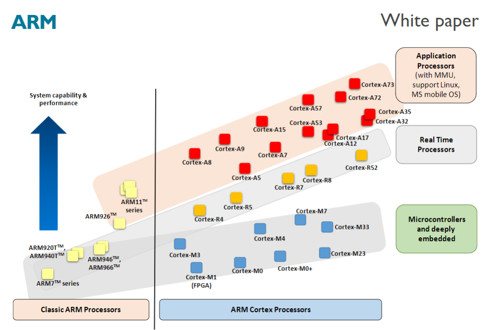

#  前言
随着对stm32以及其RTOS的深入，我逐渐意识到要真正深刻地了解其工作原理，对其cortex-m内核的了解是必须的。因此，我在学习过程中编写了如下笔记，希望能对后人有所帮助。
# ARM架构内核发展史

正如上图所见，多年来，ARM 开发了众多不同的处理器产品。ARM 处理器分为经典 ARM 处理器和较新的 Cortex 处理器产品系列。这些处理器根据应用领域又分为三组：  

应用处理器——用于移动计算、智能手机、服务器等的高端处理器。这些处理器运行在更高的时钟频率（超过 1GHz），并支持内存管理单元 (MMU)，这是 Linux、Android、MS Windows 等全功能操作系统和移动操作系统所必需的。

实时处理器——这类处理器性能极高，适用于实时应用，例如硬盘控制器、汽车动力传动系统和无线通信中的基带控制。大多数这类处理器没有 MMU(内存管理单元,后面搞懂了再讲)，通常具有内存保护单元 (MPU)、缓存和其他专为工业应用设计的内存功能。它们可以以相当高的时钟频率运行（例如 200MHz 至 1GHz 以上），并且响应延迟极低。虽然这些处理器无法运行完整版 Linux 或 Windows，但许多实时操作系统 (RTOS) 可以与这些处理器兼容。  （实际上很多裁剪的Linux都可以运行）  

微控制器处理器——这类处理器通常设计得更小，硅片面积更小，能效更高。STM32等就属于这个行列。通常情况下，它们的流水线（这是CPU设计中的东西，pipline）更短，最大频率也更低（尽管有些处理器的运行频率超过 200MHz）。同时，较新的 Cortex-M 处理器系列设计得非常易于使用，因此在微控制器和深度嵌入式系统市场非常受欢迎。

## 常见Cortex-M架构的单片机
这里只介绍我们用的Cortex-M4架构的（不同代之间可能指令集，架构都不同，所以介绍其他的没有必要）  
比较著名的单片机供货商都使用了Cortex-M4，比如意法半导体的：  
STM32F4 系列：STM32F401, STM32F407, STM32F429, STM32F446 等  
Texas Instruments（德州仪器）的：  
TM4C 系列（原 Stellaris LM4F）：TM4C123, TM4C1294 等  

## Cortex-M4的特性
我们使用的cortex-m4支持DSP（数字处理拓展），F4更是有FPU单元。这些后面会讲到，现在先关注其最大的特点：异常处理。  
cortex-m内核有两种操作模式，thumb模式和调试模式。thumb模式下，系统会正常执行代码，并且在出现异常的时候跳转到异常处理模式，直到异常返回才会继续运行。调试模式下，程序会暂停，直到调试器控制退出暂停，返回thumb模式。  
这个调试模式的暂停，一般就是keil等调试时候打的断点。而异常处理部分值得一看，这个“异常”并非Erro报错等，而是将ISR中断等，被视作普通代码外的“异常”。（其实硬件错误也是异常，不过尚不清楚关系，这里只讨论中断异常）
内核是通过三个优先级来进行在普通代码，启动代码和异常处理之间切换的。普通代码属于一般优先级，启动代码属于特权优先级，异常处理属于特权处理优先级，其关系是：一般＜特权＜特权处理。这保证了NVIC中断向量表等关键寄存器不被普通代码篡改。
因此，FreeRTOS等RTOS可以不用担心用户对内核寄存器的破坏，保证其调度在高优先级（除了中断，依然可以打破其优先级）
这个方法可以用来控制代码权限，比如写一个串口下载程序，其在完全下载完成校验完成后才会提升到更高权限层，并被允许写入flash，以避免升级出错导致系统崩溃。

### 拓展知识
https://hdu-cs.wiki/10.%E7%A1%AC%E4%BB%B6%E6%A8%A1%E5%9D%97/10.3%20%E8%A3%B8%E6%9C%BA%E4%BB%8B%E7%BB%8D/10.3.2%20STM32/10.3.2.4%20%E4%BD%93%E7%B3%BB%E6%9E%B6%E6%9E%84/10.3.2.4.2%20Cortex_M%E5%86%85%E6%A0%B8%E7%BB%93%E6%9E%84.html一文基本介绍了各个内核寄存器以及优先级，中断异常处理机制等等。
https://blog.csdn.net/weixin_55672545/article/details/130453893
则快速建立了内核架构的概念。

