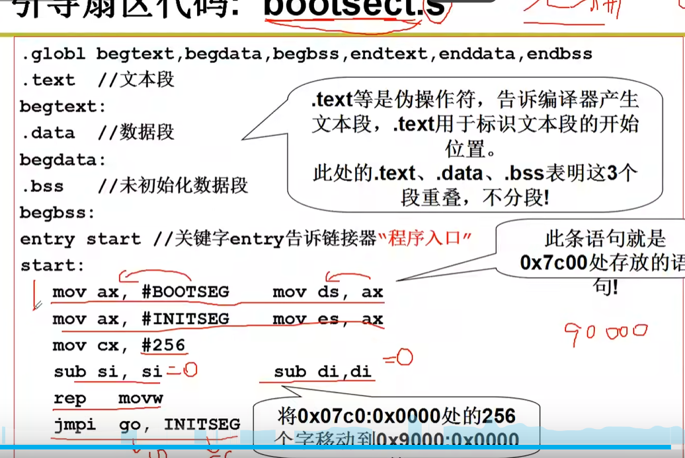
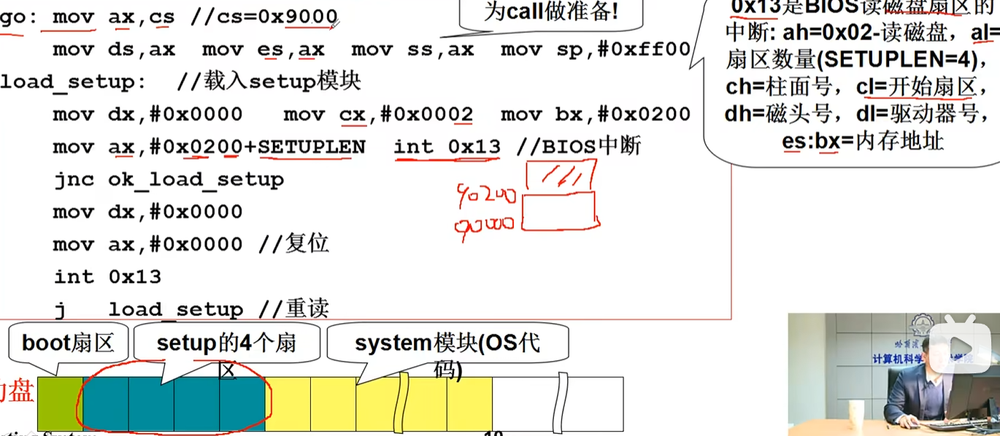
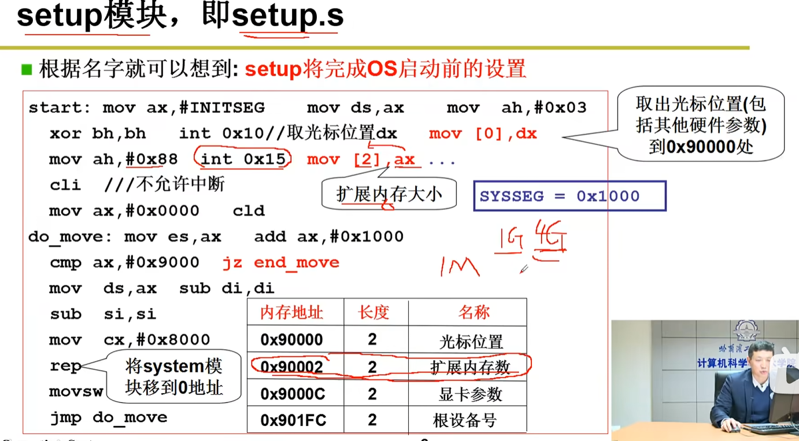

#  前言
单纯想学。不打算作为他人可读的笔记，做记录如下：
## 计算机的启动
开机的时候，CPU处于实模式（x86是这样的，后面如果了解了别的情况，这里加个超链接）  
实模式是CPU三种访问模式中的一种。其:  
16位指令和地址，只能访问1MB内存（0x00000到0xFFFFF）。  
没有内存保护，任何程序都能乱改内存。  
访问内存方式是段地址+偏移  
保护模式即32位，长模式即64位。实模式一般用于BIOS和Boot等。
1. **初始化**  
初始化的时候CS(（Code Segment Register，代码段寄存器）)为0xFFFF，IP（Instruction Pointer，指令指针寄存器）为0x0000,实际访问的地址是CS<<4(也就是乘以16,2的4次方)加上IP（偏移）。  
这里把CS*16是因为内存是分段的，16位一段，CS储存的是代码段的地址，因此其储存的都是16位16位分隔的地址。比方说0x1000，移动16就到了0x10000，加上IP就能访问到0x10000段地址的东西了。  
2. **寻址0xFFFF0**
初始化后，其会访问到0xFFFF0（就是初始化默认的地址）这块地址里储存了检查RAM,磁盘,cpu,显示器等等的代码
3. **读入引导**
在此处，系统会读取磁盘0磁道0扇区的引导代码，将其写入到内存的0x7c00处。引导扇区的代码有512字节大。启动设备的信息记录在CMOS里。
这里磁盘磁道扇区是机械硬盘的概念，在固态硬盘里通常使用逻辑扇区模拟。此处也可以插入一个超链接来看详细的内容。  

以下是视频中的代码截屏，因为信息量比较大所以就用截图了。
  
图中的ax，cx，si，di分别是累加寄存器，计数寄存器，源变址寄存器，目的变址寄存器。从名字可看出，累加寄存器就是用来累加的，一般可以反复往里面复制变量，这样就可以做到相加。

ds，es就是段寄存器，储存段的位置的。
rep movw 这段汇编里，rep会重复执行后面填入的参数指令，执行一次cx减一，也就是运行cx次。movw就是搬运2字节的数据，从源变址si搬运到目的变址di。这个搬运过程中，si和di会自增2（自增自减由 DF (Direction Flag，方向标志位)控制）  
这里用到ax单纯就是因为ds，es不能直接填，需要ax中转。  
综上所述，这段代码实现了将这段数据移动到0x9000这个段内的功能。接下来jmp,go ins...就是移动到0x9000,到了自己搬家后的位置，代码可以顺序执行了。由于这个mov只是做复制粘贴，不会删除本地的值，所以不用担心搬着搬着自己代码没了。  

4. **初始化setup**
这里，我们的操作系统开始正式初始化。  



同样的，先介绍常用寄存器。CS指向目前代码所在的段，SS表示栈段，SP表示栈指针  
可见前面这行将栈的位置设置在了0x900这个代码运行的位置。  
下面的代码可以简化地认为，从磁盘0(dx,由高低两部分组成DH/DL)读取第二个扇区(cx)，读取的扇区数量根据ax取得（ax，AH/AL同样是高八位和低八位） 

下面的jnc = jump if no carry，表示如果CF进位寄存器为0（这里作为错误寄存器使用）那么就跳过以下的内容，也就是一段错误处理。  
总而言之，boot的服务基本上到此结束，后面的操作就是启动了0x10中断，获取了光标位置，然后在光标位置打印字符。这个也就是我们常见的开机LOGO,涉及到寄存器bp，ah，bh,然后跳转到0x90
20:0000开始执行setup.s  

int 0x13（BIOS 磁盘服务）常用寄存器约定如下：

输入：
AH = 功能号（02h = 读扇区，00h = 重置磁盘控制器等）  
AL = 要读/写的扇区数量（1..）  
CH = 柱面号的低 8 位  
CL = 扇区号（低 6 位） + 柱面号的高 2 位  
DH = 磁头号  
DL = 驱动器号（由 BIOS 传入）  
ES:BX = 数据缓冲区目标地址（段:偏移）  
## 系统的启动
我原先是想把操作系统的启动也写在计算机的启动内的，但是实在太长太繁杂，因此单独开一个条目来讲（记录）  
同样是先将寄存器过一遍。这里新出现（或者我忘记了的）有ah，bh，这个就是ax和bx的高八位罢了。  
这里，setup将启用0x15中断，获取拓展内存数量并且存入0x90002

简而言之，就是读取硬件的各种情况，比如显卡，内存等参数。
do_move那一段，可以看到修改了段地址和段附加地址，还有看到ax一直被加0x1000.上面说过段地址是16位的，这里恰好16位，也就是移动一个段。又可以看到底下cmp对ax和0x9000做了对比，也就是ax为0x9000的时候终止。  
很容易得到，以上代码就是利用ax自增在复制与赋值ds前的特性，进行rep，从0x0000开始，把代码从0x1000搬运到0x0000，然后再0x2000搬运到0x1000....以此类推，直到0x8000就不搬运了（ax达到0x9000了）。前面的cli禁止中断也是为了这里服务的。
现在我们回头看bootsect的代码，其中将代码搬运到0x9000后的原因，现在也得以知晓了:为了给setup空出空间来塞操作系统的代码。之后，操作系统就会一直停留在这个位置。  
最后，setup将CPU模式改为保护模式，也就是32位模式。  
这个改法是通过修改寄存器cr0:为1为保护模式，0为实模式。
在更改到32位模式后，寻址方式改变，不再是CS<<4+IP，而是GDT和IDT
## 32位寻址
### GDT
GDT（Global Descriptor Table，全局描述符表），是一种用来描述内存的数据结构。他的本质就是一段连续的内存，以类似数组的结构储存了各个内存段的地址和各类参数。其使得内存段不再是固定大小的片段，而是可以自定义与拓展，并且提供不同访问权限，描述符和类型等段性质。  
在GDT中，CS寄存器的作用变为“选择子”，具体的做法大概如下：
选择子对应GDT表中的一个部分，是一种指针性质的东西，目的是用来查找你需要的的表的位置。
而选择子指向的就是“表项”，也称为描述符，其是一个结构固定的部分，由基地址，访问权限，段类型,段长度限制等构成。
如果使用c模拟表示，大概长这样：
```"C"
struct GDTEntry {
    uint16_t limit_low;
    uint16_t base_low;
    uint8_t base_middle;
    uint8_t access;
    uint8_t granularity;
    uint8_t base_high;
};

struct GDTEntry gdt[3];  // 定义 3 个表项
```
而具体地说，
选择子的结构一般如下：
```
15  14 13 12 11 10 9 8 7 6 5 4 3 2 1 0
+---+---+---+---+---+---+---+---+---+---+---+---+---+---+---+---+
|   Index (13位)   | TI | RPL (2位)  |
+---+---+---+---+---+---+---+---+---+---+---+---+---+---+---+---+
```
在通过选择子访问到表项，再根据表项算出真实物理地址后，CPU即完成一次内存访问。
### IDT
IDT（Interrupt Descriptor Table，中断描述符表）
IDT的结构与GDT类似，也是一种数组类型的连续内存。但是其储存的是中断类型。