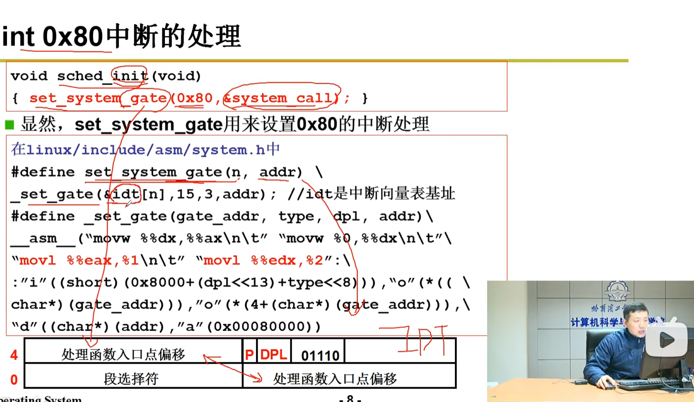

#  前言
单纯想学。不打算作为他人可读的笔记，做记录如下：
## 计算机的启动
开机的时候，CPU处于实模式（x86是这样的，后面如果了解了别的情况，这里加个超链接）  
实模式是CPU三种访问模式中的一种。其:  
16位指令和地址，只能访问1MB内存（0x00000到0xFFFFF）。  
没有内存保护，任何程序都能乱改内存。  
访问内存方式是段地址+偏移  
保护模式即32位，长模式即64位。实模式一般用于BIOS和Boot等。
1. **初始化**  
初始化的时候CS(（Code Segment Register，代码段寄存器）)为0xFFFF，IP（Instruction Pointer，指令指针寄存器）为0x0000,实际访问的地址是CS<<4(也就是乘以16,2的4次方)加上IP（偏移）。  
这里把CS*16是因为内存是分段的，16位一段，CS储存的是代码段的地址，因此其储存的都是16位16位分隔的地址。比方说0x1000，移动16就到了0x10000，加上IP就能访问到0x10000段地址的东西了。  
2. **寻址0xFFFF0**
初始化后，其会访问到0xFFFF0（就是初始化默认的地址）这块地址里储存了检查RAM,磁盘,cpu,显示器等等的代码
3. **读入引导**
在此处，系统会读取磁盘0磁道0扇区的引导代码，将其写入到内存的0x7c00处。引导扇区的代码有512字节大。启动设备的信息记录在CMOS里。
这里磁盘磁道扇区是机械硬盘的概念，在固态硬盘里通常使用逻辑扇区模拟。此处也可以插入一个超链接来看详细的内容。  

以下是视频中的代码截屏，因为信息量比较大所以就用截图了。
  
图中的ax，cx，si，di分别是累加寄存器，计数寄存器，源变址寄存器，目的变址寄存器。从名字可看出，累加寄存器就是用来累加的，一般可以反复往里面复制变量，这样就可以做到相加。

ds，es就是段寄存器，储存段的位置的。
rep movw 这段汇编里，rep会重复执行后面填入的参数指令，执行一次cx减一，也就是运行cx次。movw就是搬运2字节的数据，从源变址si搬运到目的变址di。这个搬运过程中，si和di会自增2（自增自减由 DF (Direction Flag，方向标志位)控制）  
这里用到ax单纯就是因为ds，es不能直接填，需要ax中转。  
综上所述，这段代码实现了将这段数据移动到0x9000这个段内的功能。接下来jmp,go ins...就是移动到0x9000,到了自己搬家后的位置，代码可以顺序执行了。由于这个mov只是做复制粘贴，不会删除本地的值，所以不用担心搬着搬着自己代码没了。  

4. **初始化setup**
这里，我们的操作系统开始正式初始化。  


同样的，先介绍常用寄存器。CS指向目前代码所在的段，SS表示栈段，SP表示栈指针  
可见前面这行将栈的位置设置在了0x900这个代码运行的位置。  
下面的代码可以简化地认为，从磁盘0(dx,由高低两部分组成DH/DL)读取第二个扇区(cx)，读取的扇区数量根据ax取得（ax，AH/AL同样是高八位和低八位） 

下面的jnc = jump if no carry，表示如果CF进位寄存器为0（这里作为错误寄存器使用）那么就跳过以下的内容，也就是一段错误处理。  
总而言之，boot的服务基本上到此结束，后面的操作就是启动了0x10中断，获取了光标位置，然后在光标位置打印字符。这个也就是我们常见的开机LOGO,涉及到寄存器bp，ah，bh,然后跳转到0x90
20:0000开始执行setup.s  

int 0x13（BIOS 磁盘服务）常用寄存器约定如下：

输入：
AH = 功能号（02h = 读扇区，00h = 重置磁盘控制器等）  
AL = 要读/写的扇区数量（1..）  
CH = 柱面号的低 8 位  
CL = 扇区号（低 6 位） + 柱面号的高 2 位  
DH = 磁头号  
DL = 驱动器号（由 BIOS 传入）  
ES:BX = 数据缓冲区目标地址（段:偏移）  
## 系统的启动
我原先是想把操作系统的启动也写在计算机的启动内的，但是实在太长太繁杂，因此单独开一个条目来讲（记录）  
同样是先将寄存器过一遍。这里新出现（或者我忘记了的）有ah，bh，这个就是ax和bx的高八位罢了。  
这里，setup将启用0x15中断，获取拓展内存数量并且存入0x90002

简而言之，就是读取硬件的各种情况，比如显卡，内存等参数。
do_move那一段，可以看到修改了段地址和段附加地址，还有看到ax一直被加0x1000.上面说过段地址是16位的，这里恰好16位，也就是移动一个段。又可以看到底下cmp对ax和0x9000做了对比，也就是ax为0x9000的时候终止。  
很容易得到，以上代码就是利用ax自增在复制与赋值ds前的特性，进行rep，从0x0000开始，把代码从0x1000搬运到0x0000，然后再0x2000搬运到0x1000....以此类推，直到0x8000就不搬运了（ax达到0x9000了）。前面的cli禁止中断也是为了这里服务的。
现在我们回头看bootsect的代码，其中将代码搬运到0x9000后的原因，现在也得以知晓了:为了给setup空出空间来塞操作系统的代码。之后，操作系统就会一直停留在这个位置。  
最后，setup将CPU模式改为保护模式，也就是32位模式。  
这个改法是通过修改寄存器cr0:为1为保护模式，0为实模式。
在更改到32位模式后，寻址方式改变，不再是CS<<4+IP，而是GDT和IDT
## 32位寻址
### GDT
GDT（Global Descriptor Table，全局描述符表），是一种用来描述内存的数据结构。他的本质就是一段连续的内存，以类似数组的结构储存了各个内存段的地址和各类参数。其使得内存段不再是固定大小的片段，而是可以自定义与拓展，并且提供不同访问权限，描述符和类型等段性质。  
在GDT中，CS寄存器的作用变为“选择子”，具体的做法大概如下：
选择子对应GDT表中的一个部分，是一种指针性质的东西，目的是用来查找你需要的的表的位置。
而选择子指向的就是“表项”，也称为描述符，其是一个结构固定的部分，由基地址，访问权限，段类型,段长度限制等构成。
如果使用c模拟表示，大概长这样：
```"C"
struct GDTEntry {
    uint16_t limit_low;
    uint16_t base_low;
    uint8_t base_middle;
    uint8_t access;
    uint8_t granularity;
    uint8_t base_high;
};

struct GDTEntry gdt[3];  // 定义 3 个表项
```
而具体地说，
选择子的结构一般如下：
```
15  14 13 12 11 10 9 8 7 6 5 4 3 2 1 0
+---+---+---+---+---+---+---+---+---+---+---+---+---+---+---+---+
|   Index (13位)   | TI | RPL (2位)  |
+---+---+---+---+---+---+---+---+---+---+---+---+---+---+---+---+
```
在通过选择子访问到表项，再根据表项算出真实物理地址后，CPU即完成一次内存访问。
一言以蔽之，就是间接寻址。
### IDT
IDT（Interrupt Descriptor Table，中断描述符表）
IDT的结构与GDT类似，也是一种数组类型的连续内存。但是其储存的是中断类型。原先的中断/异常向量号变成了索引，对应不同的中断回调处理函数。原视频没有细讲这个，因此我也略过，这里的结构大概和GDT类似吧
### 故障机器人，启动！
此处操作系统正式启动。setup的最后部分会跳转到head.s。
操作系统编译出来是image，是由源码编译出来的
值得注意的是，这里的汇编变成了32位模式的汇编，因此要有所改变。
在head.s中，重新初始化了GDT和IDT表，取代了之前的临时表。
#### 不同的汇编
可以看到，这里的汇编中多了很多我们不清楚的知识。

实际上，操作系统中汇编大致有三种，我们前面使用的是as86汇编，也就是传说中第一台个人PC牵牛星使用的8086（不得不佩服一下当时的程序员）CPU的汇编代码，是16位的。  
还有一种汇编是GNU as汇编，产生的是32位代码，使用AT&T系统V语法（一个美国公司的规范）  
最后，还有一种汇编叫做内嵌汇编，是可以嵌入在C语言中的，使用gcc编译.c文件产生的中间结果.s（不是目标文件.o）也是这种类型。内嵌汇编（inline asm）在默认情况下使用的是 GNU as 的语法（也就是 AT&T 语法）,只不过有一些细枝末节的差异，并且是可以通过配置来修改的。
各种汇编之间的详细差异如下：
- Intel 语法（MASM/NASM/TASM 等常见语法）  

    - 操作数顺序： dest, src（先目的后来源）  
    - 寄存器/立即数前通常不加 % 或 $（直接写 eax、10h 等）  
    - 内存寻址用方括号： [ebp + 4] 或 [eax+ecx*4+8]  
    - 更接近教材/CPU 手册里的写法，也是 Windows 下汇编器常用语法
    例： mov eax, 0x10  

- AT&T 语法（GNU as / gas 的传统语法，Linux 下很多源码/objdump -d 用这个）  

    - 操作数顺序： src, dest（先来源后目的）  
    - 寄存器前加 %： %eax，立即数前加 $： $0x10  
    - 指令后缀表示长度： movb (8-bit), movw (16-bit), movl (32-bit)；在 x86-64 下还有 movq  
    - 内存寻址更“函数式”： disp(base, index, scale) 例如 8(%ebp) 或 4(%ebx,%ecx,4)
    - 例： movl $0x10, %eax （即把立即数 0x10 载入 %eax）  


也就是说，head.s里使用的是内嵌汇编，即AT&T语法。  

### 从汇编到C
现在我们知道了head.s负责初始化各种寄存器，然后跳转到OS的main.c里（具体来说，跳转前还初始化了内存页表）。这里我们从汇编到了C，这个过程是怎么实现的呢？  
要解答这个问题，我们需要先把C中的函数讲清楚。  
在C中，函数的互相调用是通过call和ret汇编实现的。大概的流程如下：
首先会进行压栈，把原函数的返回地址，被调用函数的参数压入被调用函数的栈内，再跳转进入对应栈，然后完成被调用函数后，再跳转回到原函数，继续接下来的操作。


### main.c
跳转到main使用的是jmp，不包含返回，因此如果返回一般会出现各种错误，为了避免非预期的行为，jmp下面是一段汇编死循环避免执行到下面内存的内容。
  
main函数内容主要由各种init组成。
``` "c"
void mem_init(long start_mem, long end_mem)
{
    int i;
    for (i = 0; i < PAGING_PAGES; i++)
        mem_map[i] = USED;

    i = MAP_NR(start_mem);
    end_mem -= start_mem;
    end_mem >>= 12;   /* 右移 12 = 除以 4096 (4KB) */
    while (end_mem-- > 0)
        mem_map[i++] = 0;
}
```
其中上述的mem_init最值得展开描述。
可以观察到，主要是一个循环，其先将部分内存标记为使用过，然后接下来将系统可用最高内存位置减去内存起点位置，得到内存区域大小。
后续的>>=12，即将其除以“页”的大小。

MAP_NR 是个宏，把一个物理地址（或字节偏移）转换为 mem_map 的索引（即页号）。通常等价于 start_mem >> PAGE_SHIFT（PAGE_SHIFT 在 x86 上通常是 12）


## 操作系统接口
- 接口的定义：转换信号，隐藏细节。
与操作系统的交互，无论是Shell，还是图形化界面，实际上都是调用操作系统的一个接口。
（所谓图形化窗口，就是一个不断循环绘制UI的函数,并且不断监听用户输入（从消息队列取消息并且处理）罢了）,大概的流程如下:
  
容易得出，操作系统的接口其实就是一系列的c函数，其能实现一些关键的与硬件/系统有关的功能。这个又称为系统调用。
根据IEEE的标准，系统调用应该符合一个叫POSIX: Portable Operating System Interface of Unix
的规范。其中比较经典的EACCES接口，就是用于调用接口但权限不足时返回报错的。
为了隐蔽操作系统中重要的数据，必须避免同在内存中的应用程序直接访问到操作系统的内存片段。也就是说，不允许直接的jmp。因此，操作系统在硬件层面上采取了权限分级：

如上所示，操作系统被分为内核态和用户态。这个区分就使用的是CS地址的最低两位，0表示内核态，3表示用户态。
但是有时候系统调用，需要使用一些比较高级的内存内容，但是我们依然不能直接给予其权限，因此便引入了以下概念：
CPL（Current Privilege Level）：当前执行代码的特权级（从 CS 得到）。
RPL（Requestor Privilege Level）：请求访问时所用“段选择子”的低两位（例如 DS 的选择子），表示“请求者希望以哪个级别来访问”。
DPL（Descriptor Privilege Level）：段描述符里定义的访问权限级别，表示谁可以访问这个段（例如某个数据段/代码段的 DPL）
以上这些基本上存在GDT，也就是内存表中。
当我们进入shell，系统会自动把CS的低两位置1，也就是变成用户态。
这里的DPL可以看成权限等级，只有等级比这个高（就是数字更小，比如1级高于3级这样），才能访问这段DPL对应级别的内存。具体来说，就是取CPL和RPL的最大值（即权限最低的，比如你申请用1级，但是CPL记录的3级，3级大于2级，所以你不能访问2级的内存）
而系统调用、中断等会有专门的门，这些后面才会提到。

## 系统调用详细内容
用户态进入内核态，只有唯一一种办法：中断  
通常来说，这个中断是int 0x80。int指令将CPL改为0，从而进入内核态
“在使用 int 0x80 的约定中，系统调用号通常放在寄存器 eax，参数按顺序放入 ebx、ecx、edx、esi、edi、ebp 等寄存器，内核执行后把返回值放回到 eax。若出错，内核通常返回一个负的 errno 值，用户态的封装会把负值转成 -1 并设置 errno。”
  
因此用户代码进行一次系统调用内核代码的过程就是：  
用户使用包含int指令的代码发起中断——>
操作系统写中断处理，获取需要的程序编号——>
根据对应的编号执行对应代码。

open,write等等都是通过这个手段实现的,其流程（ai整理）可以大致归纳如下
```
+--------------------+       +--------------------+       +--------------------+
| 应用程序 (user)    |  ---> | C 库 (libc)        |  ---> | 内核 (kernel)      |
| printf(...)        |       | printf -> write()  |       | sys_write(...)     |
+--------------------+       +--------------------+       +--------------------+
                               |                       ^
                               | syscall wrapper       |
                               v                       |
                         +--------------------+        |
                         | 系统调用封装 (用户态)| ------+
                         | e.g. _syscall3 / syscall() |
                         +--------------------+
                               |
                               v
                         +--------------------+
                         | 触发陷阱 / 中断     |
                         | int $0x80 / syscall |
                         +--------------------+
```
也就是这种include里的底层库，会有一个#define 之类的宏，展开来就是包含int 0x80的内嵌汇编代码，执行系统交互。
### INT 0X80做了什么
实际上，与单片机类似，操作系统（至少是这个i386的Linux0.6）也维护着一个中断向量表。0X80就是其中的一个中断，这里一般配置为write的系统调用回调函数。前文提到过用于跳转的GDT表，现在0X80用的就是中断相关的IDT表。
如果你还记得一开始提到的sched_init的话，那你应该能注意到其中的set_system_gate....这个函数，这个就是用于配置中断向量表的。
具体展开的话，这个函数如下：


可以看到其中有_set_gate(&idt[n],15,3,addr),这个idt显然就是idt表，这个n就是表的索引，15表示这是“ trap gate”，3表示DPL状态，就是允许用户态（3级）访问。最后的addr就是中断处理函数的入口。
汇编中的具体过程是这样的：

首先用movw %dx，%ax，把dx寄存器的值赋给ax（这里是asm汇编因此是前者给后者），然后把段选择子给dx。
如果你还记得的话，我们要访问内存就需要通过GDT表映射，这个0X08魔数就是指的是内核代码段。回顾一下，段选择子就是三部分组成的，Index索引到GDT/LDT，TI表示去GDT或LDT，RPL是请求的等级（用户态那些东西）。如上0x08就是index=1.TI=0.RPL=0，最高特权级访问GDT的第一个项。

继续回顾，AX,DX就是这个选择内存地址用的寄存器。只不过这里还是用16位的形式访问。  
这里的%1，%2就是操作数列表，属于汇编的内容。（我大概得专门开一栏学汇编吧）
整理一下，这个代码的执行流程是这样的：
首先把后面的操作数存起来，操作数根据顺序会表示为0,1,2等。
- %0：一个立即数常量  
- %1：gate_addr 指向的内存位置  
- %2：gate_addr + 4 指向的内存位置  
- %dx：addr  
- %eax：0x00080000  
以上即表示，将0表示为一个常亮，1表示为参数addr，dx寄存器填入addr，eax填入0x00080000等。所有这些操作都在第一条汇编指令开始之前完成。
然后开始执行第一条汇编：
movw %dx, %ax  
它就表示,将dx的数据存到ax中
然后  
movw %0, %dx  
就是把0的数值移动到dx中
movl %eax, %1
表示把eax寄存器的内容写到1对应的地址中
movl %edx, %2
表示把edx寄存器的内容写到2对应的地址（1的后4位）中

如果改写成C大概就是这样```
idt[n].offset_low  = addr & 0xffff;
idt[n].selector    = 0x08;
idt[n].type_attr   = 0x80 | (dpl << 5) | type;
idt[n].offset_high = (addr >> 16) & 0xffff;
```\

trap gate就是进入后不会自动关中断的中断入口类型。
与之相对的就是interrupt gate，会自动清理IF，自动关中断。
本质上，这是一个“中断门”，也就是把addr的地址拆分成高八位和第八位，然后