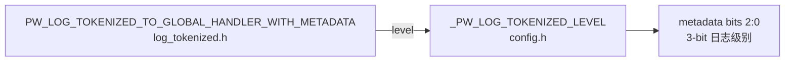
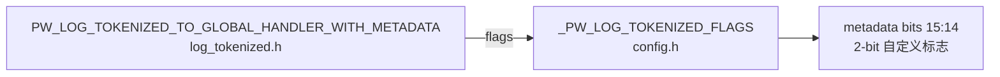
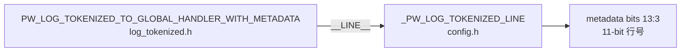
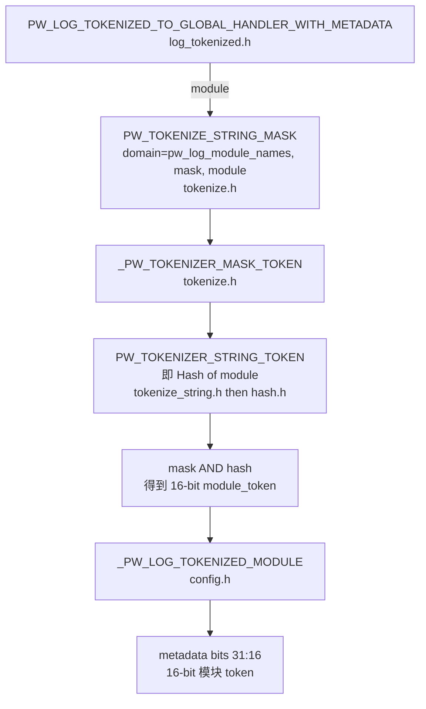
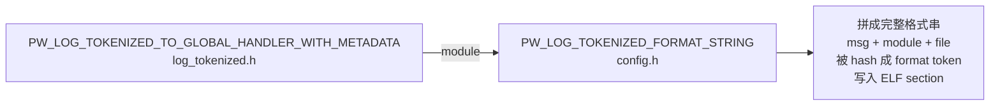
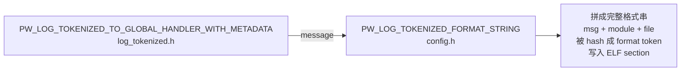
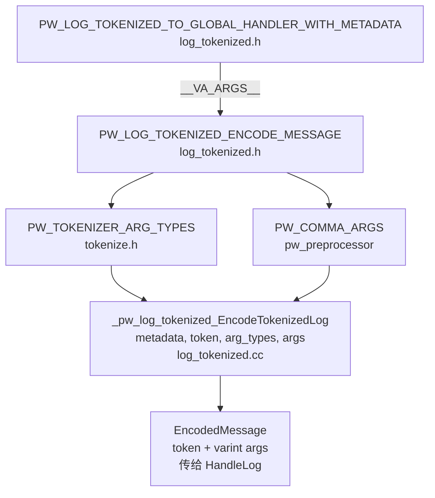
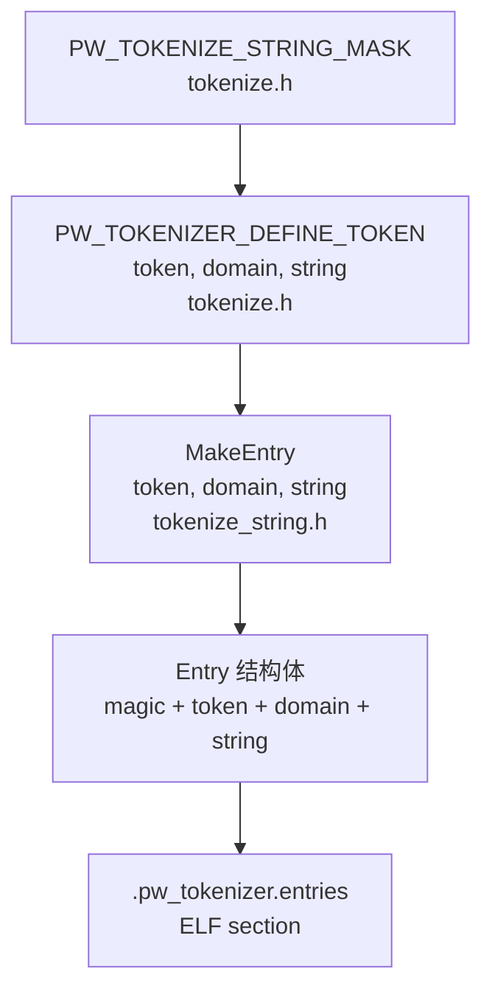
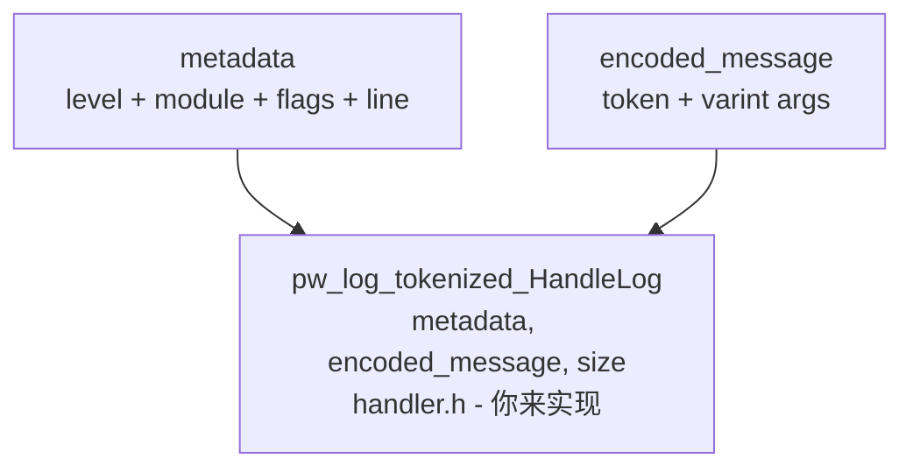

# 前言
又来挖新坑了。作为学习rtos的一个娱乐部分，我最近发现了个很有意思的log库，是出自谷歌的pigweed。所以今天又来看看码。
# 项目结构
这个结构乱的很。pigweed下有pw_log_tokenized，还有它的Zephyr变体。我先看看原版是怎么实现的吧。这个底下还有两个override文件夹，这个英文意思是覆写，应该就是比较上层的文件了。然后还有public，下有主文件夹。再就是还有一个public_override，也不知道是做什么的。此外就是一些测试脚本了。那么看起来关键就在public里的主文件夹。先从覆盖层入手：
（依旧不看文档这一块）（神人谷歌还留了个空文件当做编译开关）
```
// This override header includes the main tokenized logging header and defines
// the PW_LOG macro as the tokenized logging macro, without the metadata
// payload.
#pragma once

#include "pw_log_tokenized/config.h"
#include "pw_log_tokenized/log_tokenized_light.h"

#define PW_HANDLE_LOG PW_LOG_TOKENIZED_TO_GLOBAL_HANDLER

#define PW_LOG_FLAG_BITS PW_LOG_TOKENIZED_FLAG_BITS
```
大概就是这么个事，这个文件应该是用来
又是一大堆熟悉的宏魔法....让我们继续看吧...
下面那个宏`#define PW_LOG_FLAG_BITS PW_LOG_TOKENIZED_FLAG_BITS`显然是来自config.h的，稍后再看。先看看较复杂的前一个宏
`#define PW_HANDLE_LOG PW_LOG_TOKENIZED_TO_GLOBAL_HANDLER`  
```c
#define PW_LOG_TOKENIZED_TO_GLOBAL_HANDLER(level, module, flags, message, ...) \
  do {                                                                         \
    (void)level;                                                               \
    (void)flags;                                                               \
    PW_LOG_TOKENIZED_ENCODE_MESSAGE_LIGHT(                                     \
        PW_LOG_TOKENIZED_FORMAT_STRING(module, message), __VA_ARGS__);         \
  } while (0)

```
可以看到这里重定义了一个do-while循环。前面两个是什么意思呢？
我们先看另外一个overridde就知道了：
```
#pragma once

#include "pw_log_tokenized/config.h"
#include "pw_log_tokenized/log_tokenized.h"

#define PW_LOG_FLAG_BITS PW_LOG_TOKENIZED_FLAG_BITS

#include "pw_log_tokenized/gcc_partially_tokenized.h"

```
可见不仅少了一个宏，还有个很奇怪的include顺序。这里的include顺序是为了引入config里面的宏，然后经过重定义使其可以被tokenized等使用，然后最终提供给外部的PW_LOG识别。谷歌在这里把tokenized的Log也当成后端了，只是log的一种实现方式（什么后端套后端）（恼）
它缺少了一个HANDLE宏，但是多了个include。显然缺少的宏在include里面：
```c
#pragma once

#include "pw_log_tokenized/log_tokenized.h"

#if !defined(__cplusplus) || !defined(__GNUC__) || defined(__clang__)

// If we're not compiling C++ or we're not using GCC, then tokenize the log.
#define PW_HANDLE_LOG PW_LOG_TOKENIZED_TO_GLOBAL_HANDLER_WITH_METADATA

#else  // defined(__cplusplus) && defined(__GNUC__) && !defined(__clang__)

#include <string_view>

#include "pw_log_string/handler.h"

// GCC has a bug resulting in section attributes of templated functions being
// ignored. This in turn means that log tokenization cannot work for templated
// functions, because the token database entries are lost at build time.
// For more information see https://gcc.gnu.org/bugzilla/show_bug.cgi?id=70435
//
// To work around this, we defer to string logging only in templated contexts.
//
// __PRETTY_FUNCTION__ is suffixed with ' [with ...]' for templated contexts
// if the class and/or function is templated. For example:
// "Foo() [with T = char]".
#define PW_HANDLE_LOG(...)                                               \
  do {                                                                   \
    if constexpr (std::string_view(__PRETTY_FUNCTION__).back() == ']') { \
      PW_LOG_STRING_HANDLE_MESSAGE(__VA_ARGS__);                         \
    } else {                                                             \
      PW_LOG_TOKENIZED_TO_GLOBAL_HANDLER_WITH_METADATA(__VA_ARGS__);     \
    }                                                                    \
  } while (0)

#endif  // !defined(__cplusplus) || !defined(__GNUC__) || defined(__clang__)
```
前面没定义的宏`PW_HANDLE_LOG`，果然在这里定义了。
但是底下怎么又看起来有个具体的宏实现呢？
可以看到这里有个很反直觉的东西，只有在CPP,GNUC,CLANG都不存在的情况下才会使用这个宏。
在pigweed的使用条件下显然是GCC才会触发这个条件编译宏。那么为什么呢？
原因在注释里写出来了，GCC有个神秘BUG会影响模板宏的section属性，也就是不能丢到一个独立的section段里了，因此
这里单独实现了一段逻辑。为了省事我们就略过了，直接进入非GCC的那个宏。
```c
#define PW_LOG_TOKENIZED_TO_GLOBAL_HANDLER_WITH_METADATA(                    \
    level, module, flags, message, ...)                                      \
  do {                                                                       \
    _PW_TOKENIZER_CONST uintptr_t _pw_log_tokenized_module_token =           \
        PW_TOKENIZE_STRING_MASK("pw_log_module_names",                       \
                                ((1u << PW_LOG_TOKENIZED_MODULE_BITS) - 1u), \
                                module);                                     \
    const uintptr_t _pw_log_tokenized_level = level;                         \
    PW_LOG_TOKENIZED_ENCODE_MESSAGE(                                         \
        (_PW_LOG_TOKENIZED_LEVEL(_pw_log_tokenized_level) |                  \
         _PW_LOG_TOKENIZED_MODULE(_pw_log_tokenized_module_token) |          \
         _PW_LOG_TOKENIZED_FLAGS(flags) | _PW_LOG_TOKENIZED_LINE(__LINE__)), \
        PW_LOG_TOKENIZED_FORMAT_STRING(module, message),                     \
        __VA_ARGS__);                                                        \
  } while (0)

```
上面有一大段注释，去掉用于代码文档化的部分外，主要就是介绍了这个宏使用的参数与起的作用,以及提到了pw_log_tokenized_HandleLog，这个必须在其他文件里手动实现，应该是处理元数据metadata用的。
可以看到，这里是有level，moudle等参数的，这些是为了给token本身一个数据定义，使其包含分级，模块等信息， 方便一些Log查看器分层查看的。（但是我宁可在设计里面统一Warning和Erro这种前缀。顺便一提，C中的哈希化只用前32字节）它说明这个宏会 token 化两条字符串：日志格式串,模块名字符串，且模块名会被限制到 16 bit，并放到 pw_log_module_names 这个 token 域里。
这个`PW_LOG_TOKENIZED_MODULE_BITS`就是前面在config里面定义的长度比特值。它的具体含义我们后面再研究好了。先继续看实现：
`PW_TOKENIZE_STRING_MASK`,这个的实现又在一个tokenized里面了,里面套了很多层宏，我们只需要理解这个宏的作用就可以了。中间的各种封装就直接跳过好了，实在太多了。
这个宏最终展开的是两个工具宏，以及一系列的断言来检查格式。其中一个`PW_TOKENIZER_DEFINE_TOKEN`将给定的字符串打包进section，
它的关键实现如下：
```c
alignas(1) static constexpr auto _PW_TOKENIZER_SECTION PW_NO_SANITIZE(     \
      "address") _PW_TOKENIZER_UNIQUE(_pw_tokenizer_string_entry_) =         \
      ::pw::tokenizer::internal::MakeEntry(token, domain, string)
```
这个alignas指的是按 1 字节对齐，避免插入对齐填充。此后的`static constexpr auto`
是CPP语法，定义一个编译期常量静态对象，生命周期贯穿整个程序。后面的`_PW_TOKENIZER_SECTION`就是attribute的封装，和我们之前看到的RT-Thread的静态注册机制本质上是一样的。后续的NO_SANITIZEUNIQUE宏就是用于实现生成一个变量名。
按照AI的说法，这些宏的底层实现其实还是编译器拓展，比如
> 你现在看到的 tokenize.h:368 里用的是一层宏包装：

>_PW_TOKENIZER_SECTION
>展开后是 PW_KEEP_IN_SECTION(...)
>再展开后才是编译器属性
>我刚查了 Pigweed 上游定义，PW_KEEP_IN_SECTION 实际就是：

>非 Apple 平台：attribute((section(name), used))
>Apple 平台：attribute((section("__DATA," name), used))
所以实际上可以把前面一大堆看成是构建一个对象，其经过了一系列宏的修饰。
最后，各种包底下的`MakeEntry`才构造真正的条目内容：包含 magic、token、domain 长度、>string 长度，以及 domain/string 本体。最上游的literal_string传到这个makeentry方法里面，


到这里可能有点混乱了，我们重新理一下。从最上层的override的log_backend开始：


---

### 1. `level` 的流向



---

### 2. `flags` 的流向



---

### 3. `__LINE__` 的流向



---

### 4. `module` 路径 A：算 token 进 metadata



---

### 5. `module` 路径 B：拼入格式串



---

### 6. `message` 的流向



---

### 7. `__VA_ARGS__` 的流向



---

### 8. `module` 路径 A 补充：写入 ELF section



---

### 9. 最终汇合


现在我们理清楚了具体的结构。
以上的所有东西都是一个backend，最终Pigweed是去通过配置Log的后端来调用的。这个backend的入口就是我们选取的override。
以上面的full后端为例子：
```c
PW_LOG("speed: %d", rpm)
  │
  ▼  宏展开
PW_LOG_TOKENIZED_TO_GLOBAL_HANDLER_WITH_METADATA(...)
  │
  ▼  宏展开
PW_LOG_TOKENIZED_ENCODE_MESSAGE(...)
  │
  ▼  宏展开
_pw_log_tokenized_EncodeTokenizedLog(metadata, token, arg_types, args...)
  │
  │  ← 这个函数在 log_tokenized.cc 里定义
  │  ← 它把 token + args 编码成二进制 buffer
  │
  ▼  最后一行调用：
pw_log_tokenized_HandleLog(metadata, encoded_message, size)
  │
  │  ← 这个函数只有声明（handler.h）
  │  ← 你来实现
  ▼
SEGGER_RTT_Write(...)  ← 你的代码
```

原来light_override的宏具体实现
```C
/// This macro implements `PW_LOG` using `pw_tokenizer` without any metadata.
/// Users must implement `pw_log_tokenized_HandleLogWithoutMetadata(const
/// uint8_t* buffer, size_t size)`.
#define PW_LOG_TOKENIZED_TO_GLOBAL_HANDLER(level, module, flags, message, ...) \
  do {                                                                         \
    (void)level;                                                               \
    (void)flags;                                                               \
    PW_LOG_TOKENIZED_ENCODE_MESSAGE_LIGHT(                                     \
        PW_LOG_TOKENIZED_FORMAT_STRING(module, message), __VA_ARGS__);         \
  } while (0)

```
其中level什么的
