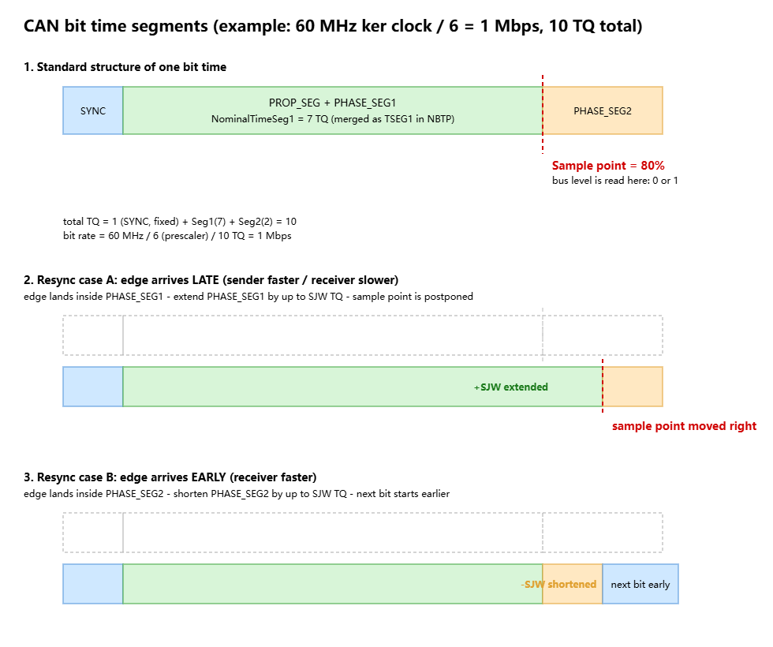

# 前言
做WS2812的时候要用到SPI6，然后发现SPI6驱动缺失，补完后被路过的程序员发现SPI6没有DMA，仔细一查只有BDMA（D3域），因此开始研究BDMA和相关的东西，着手写BDMA驱动。
## DMA是怎么开起来的？
RT-Thread使用Kconfig配置，然后通过Sconscript和env工具生成宏到rtconfig.h，这些我们已经知道了。DMA这类驱动也绕不开这套逻辑，需要开启DMA,我们就需要在BSP里面开启BSP_USING_DMA。当然，这里的驱动用了个小技巧：HAL库在开启DMA的时候会定义宏`HAL_DMA_MODULE_ENABLED`,因此不需要使用这个宏（当然我们BDMA是需要的，因为大部分BDMA逻辑和DMA混用，没有独立的宏）
开启之后整个ifdef会让drv_dma进入编译。但是DMA驱动，在RT-Thread里面是没有自动初始化的，实际上是通过SPI等实际外设提供配置调用其api实现的。
## DMA是如何初始化的？


## 题外话：CAN
本来想在老文章里面找个地方塞关于can的内容的，但是找了半天找不到合适的，遂写到这里。

CAN由两根线组成，一根High，一根low，也就是所谓的差分线。最终的逻辑电平是通过high和low之间的对比产生的。

总线上有两种电平状态：

显性（Dominant）= 0：CAN_H 抬高、CAN_L 压低，压差 ~2V  
隐性（Recessive）= 1：两根线都回到 ~2.5V 中点，压差 ~0V  

对于设备而言，存在显性和隐性两种状态。只要有任何一个设备处于显性，那么其他的设备就不会发出报文，这就是CAN仲裁的逻辑。

但是设备得先知道目前是一个有意义的1（隐性）还是无意义的空闲时间。因此，CAN 规定总线空闲 = 连续 11 个隐性位（上一帧的 EOF 7 位 + 帧间隔 IFS 3 位 + 空闲）。任何节点想发报文，都在数到这个窗口后开始发。  
另外一个问题是，所有设备都会在空闲时候试图开始发报文，这就导致了有些报文可能根本没机会发出去等问题。所以CAN根据时间段将持续的时间分隔为时间位，在这些时间位里面判断电平。
时间位内也是经过分段的：

CAN 每个位时间被内部分成段（同步段 + 传播段 + 相位段1/2）
每个节点有自己的晶振，但晶振频率不能直接当 CAN 波特率用（比如 60 MHz 太快了）。所以硬件先用一个分频器把晶振切成小格子——这个小格子就叫 TQ（Time Quantum，时间量子）。下面的例子里：60 MHz ÷ 6 = 每秒 1000 万个小格子，每个 TQ = 166ns。



TQ 就是这个节点自己的最小时间单位。而 CAN 的一位，被规定为“若干个 TQ 拼 成的”。上例里 1 位 = 10 个 TQ = 1µs，所以波特率 1 Mbps。你可以把 TQ 理解成“节拍器的小格”，一位就是“数 10 格”。  

同步段，顾名思义，用来同步各个设备对这个时间的划分。一个总线上的节点/设备，总要先确定何时这个位时间开始。因此需要这个同步段，这个段时间固定为1TQ，负责在这个时间内捕捉电平下降，如果有下降就证明这个位开始，准备进入下一个段的判断。  如果在这个时间内没有下降，就说明时间位出现了偏差，会在稍后的片段内进行时间修正，调整时间位的长短，使得采样位落在精确的位置。这个过程是同步，因此同步位本身不触发同步，只是一个用来标识这个时间划分对的准不准的应该开头依据。(CAN每六个稳定电平会掺入一个下降沿，以此来触发同步。)（由于电路中光速只有真空中的三分之二，因此CAN线上不同距离的节点收到电平的速度是不一样的）

相位段（~~相位不剑封，死法安德森~~）,就是前面提到的用来调整长度的段。如果下降沿出现在这个时间段内，那么说明时间过短，就应该略微延长这个段来把下一个同步段顶到正确的位置。
第二相位段：这段和相位段的分界线就是采样点。如果下降沿出现在这个段，说明原本应该在下一个时间位来的下降沿远远早于其时间到达了，因此就会把当前段快速结束然后进入下一个位。
值得注意的是，如果长期没有报文（长期隐性状态），那么这个同步过程就会比较暴力，先放弃读一帧的数据，根据下降沿判断出位的长度之后才会继续。
 

通常来说，监听总线的采样点在位的 75%~80% 处，也就是说一个位时间的后 20% 才是“判决时刻”。  

然后，以上的机制只能覆盖于一部分范围的漂移，如果出现延长较多tq也无法救回的差异，就会出现错误帧。 
以上所有的功能，都是用于解决“位”的，帧的最小单位是位，AI如是表达他们的关系：
```
帧是逻辑层：一帧 = 按顺序排好的 100 多个位（SOF、ID 的 11 个位、DLC 的 4 个位……），层里讨论的问题是“每一位是 0 还是 1、什么含义”。

位时序是物理层：帧里的每一个位——不管它是 SOF 还是 ID 的某一位还是 EOF 的某个隐性位——在总线上占用的都是同样一段时间结构：10 个 TQ，分四段，80% 处有个采样点。层里讨论的问题是“每一位怎么在时间上可靠地发出去、收进来”。 
```
而帧层，我们可以用一张图概括：
```
┌─────┬─────────┬─────┬─────┬────┬──────────┬──────────────┬─────────┬──────┬─────┬──────┬───────┬─────┐
│ SOF │ ID (11) │ RTR │ IDE │ r0 │ DLC (4)  │ DATA (0~8B)  │ CRC(15) │CRC界定│ ACK │ACK界定│ EOF(7)│ IFS │
│ 1位 │ 仲裁场  │ 1位 │ 1位 │1位 │ 4位      │ 8的倍数位     │ 15位    │ 1位   │ 1位 │ 1位  │ 7位   │ 3位 │
└─────┴─────────┴─────┴─────┴────┴──────────┴──────────────┴─────────┴──────┴─────┴──────┴───────┴─────┘
  ↑←──────────位填充作用于此区间──────────→
  显性   弹性域(内容任意)                        ←——— 固定域，必须隐性 ———→
  ```
  - SOF:帧首，表示一帧的开始。是显性位
  - ID:顾名思义
  - RTR:1位，表示这个是数据帧还是远程帧（不带数据，用于请求对应ID的数据）
  - IDE:标识符拓展位，表示其是标准帧还是拓展帧。拓展帧多个18位的ID
  - r0:保留位，发送方置为高电平，收方不关心，凑格式用的
  - DLC:data length code，4位，表示后面的DATA域有多少个字节。CAN里的DLC最大是8，FDCAN可以达到64字节。
  - DATA:数据域，0-8个字节，包含你要发的信息。
  - CRC:对SOF到DATA的全部位做CRC校验，15位。
  - CRC界定：区分前半段和ACK部分，1位且固定隐性
  - ACK槽：1位，发送者发隐性，接收者发显性，发送者回读看看是否被收到。
  - ACK界定：区分ACK和EOF。固定隐性
  - EOF:帧结束，连续七个隐性位。
  - IFS:帧间隔，严格来说不算帧的一部分，但是占3位左右用于区分帧，隐性   

然后，帧层面也有一层防错误机制：
错误帧由错误标志（6位显性）错误界定符（8位隐性）组成。**值得注意的是**CAN规定显式电平不能连续超过5位，因此这里是故意这么设计以此来标识这是错误帧的。错误帧是机制是，一旦某个帧看起来不对劲，比如界定符变成了显性，那么任何一个监听到错误的设备都会疯狂往总线上丢错误帧，这些帧会直接叠加在一起。由于显性帧会覆盖隐性，最终总线上总是会出现大于5位的帧，这些都会被算作错误帧。
之后，读到自己发送的是错误帧的设备，会把发送缓冲标记为未完成，然后等做错误帧结束，从SOF开始重新发，其他接收设备则丢弃当前的残帧，直接重新收。
为了避免一个有问题的设备拉胯整条总线，会出现错误计数：
- 发的帧被别人否决 → TEC +8；抓到别人的错 → REC +1；发好/收好一帧 → 各 -1（最小到 0）
- 计数 ≥ 128 → Error Passive：改发被动标志、重发前多等 8 个隐性位（suspend transmission）
- TEC ≥ 256 → Bus_Off：TX 被硬件强制隐性，节点与总线断开。恢复 = 检测到 128 次“11 个连续隐性位”（软件上就是 M_CAN 要求清 INIT 后重新走一遍启动序列），且回来时计数器清零


这套机制在 M_CAN 里有寄存器直读接口：（以下部分AI生成）

HAL_FDCAN_GetErrorCounters()——读 TEC/REC 当前值，RoboMaster 调试“总线为什么哑了”第一件事就是看它
HAL_FDCAN_GetProtocolStatus()——看当前档位（Error Active/Passive/Bus_Off）和最近一次错误类型（Stuff/Form/CRC/Ack/Bit）
HAL_FDCAN_ActivateNotification(hfdcan, FDCAN_IT_GROUP_ERROR_...)——让“进入 Error Passive / Bus_Off”变成中断回调，运行时实时监视
HAL_FDCAN_ConfigRxFifoOverwrite 之类属于软件层错误，和协议错误帧无关。错误帧机制是硬件自动的、全总线的，你的软件只在“想监控处分进度”时才参与


波特率的概念在这里也就变得比较清晰了：  
1. 它是“位格率”，直接决定一帧占线多久
1 Mbps = 每位 1µs。一帧标准数据帧（11 位 ID + 8 字节数据）约 111 个位，加上位填充最多再膨胀 ~20%，实际占线 110~135µs。由此得出总线的真实吞吐：1 Mbps 总线理论极限约每秒 7000~8000 个满载帧，扣掉仲裁等待、错误帧、帧间空隙，工程上按 50% 负载设计（即每秒 ~4000 帧）才算健康。
2. 它受“波特率 × 线长 ≤ 常数”的物理约束
这是前面传播延迟讨论的直接推论：仲裁要求一个位时间内信号完成“发出→最远节点收到→判决结果传回”，所以位时间必须大于约两倍回路延迟 + 收发器延迟 + 采样裕量。波特率翻倍，允许的线长近似减半——1 Mbps 只有几十米，125 kbps 能拉 500 米
3. "同波特率"其实是个不太对的说法。
两个节点只把波特率配成一样还不够。位时间是由 prescaler + Seg1 + Seg2 + SJW 四个参数共同定义的，同样的 1 Mbps 可以配出 75% 采样点、也可以配出 87.5% 采样点。采样点差得多的两个节点，在总线较长时一个还在等信号稳定、另一个已经开始读下一位的边沿，同步就会持续打架。所以正确的配网纪律是：全总线统一“波特率 + 采样点”两者（正规团队会在协议文档里写明 "1 Mbps, SP 80%, SJW 1"），这也是为什么 CiA 和大疆文档会给出推荐时序参数，而不是只给一个波特率数字。


然后，我们结束了.....吗？（想到这里我无疑是绝望的，怎么还有东西）  

我们没讲的还有两块：过滤器和CAN-FD

1. DLC变成码表了
原本DLC是字节数的意思，但是DLC只能表示0-15（位数不够），无法表达FDCAN的最高64字节。因此，这里使用了码表映射， 12/16/20/24/32/48/64（全是4倍数，便于寻址），对应9-15的DLC。 Committee（ISO 11898-1:2015 定稿时）选的是“小端密集、大端稀疏”的对数式分布——和浮点数尾数的思路类似：小 payload 时多给几个精细选项，大 payload 时粗粒度覆盖。
DLC 0~8 的语义在经典 CAN 和 FD 里完全一致，这让经典帧和 FD 帧的头部字段（含 DLC 解析）可以共用同一套解码逻辑——FD 是“从 DLC=9 开始才换规则”的扩展，而不是从头改写。反过来，这还带一个隐蔽的防护效果：经典 CAN 里 DLC 9~15 本来就是非法值，FD 把它们定义为“大负载码”后，如果哪个经典节点误收到 FD 帧，它会在 DLC 解析和 FDF 位置上先后发现异常——合法值域在两个协议里没有重叠歧义。
2. 