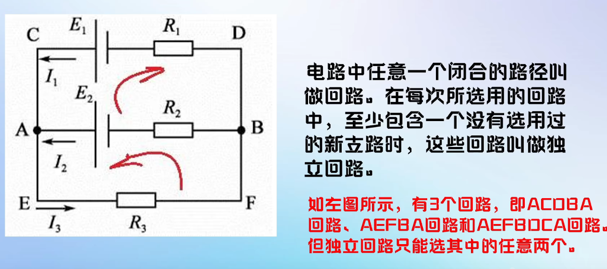
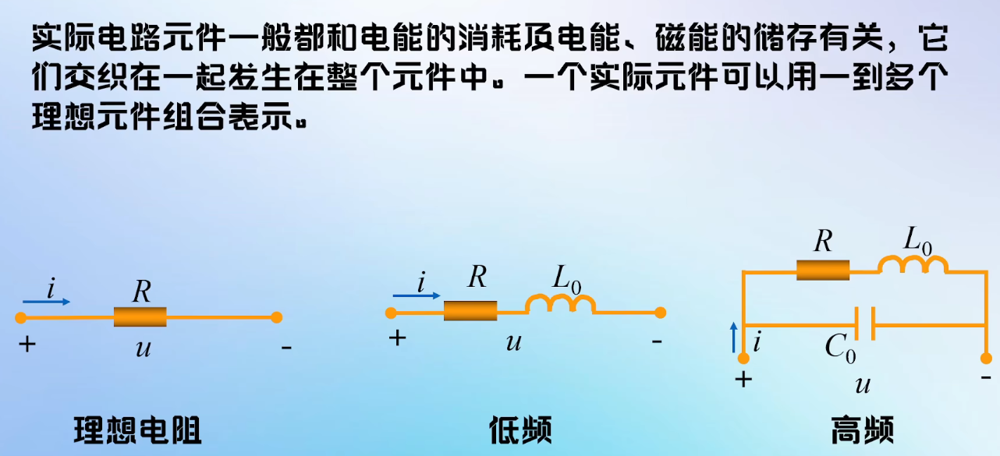
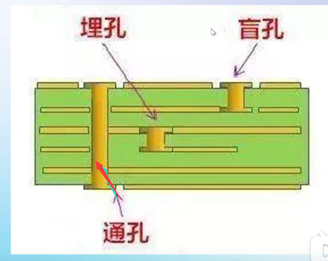
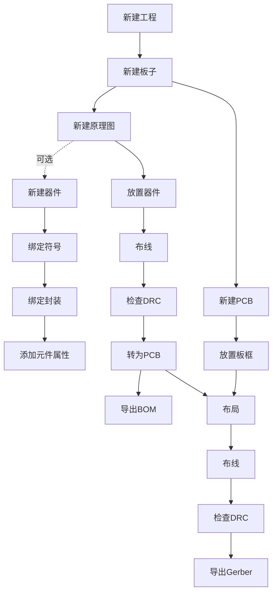
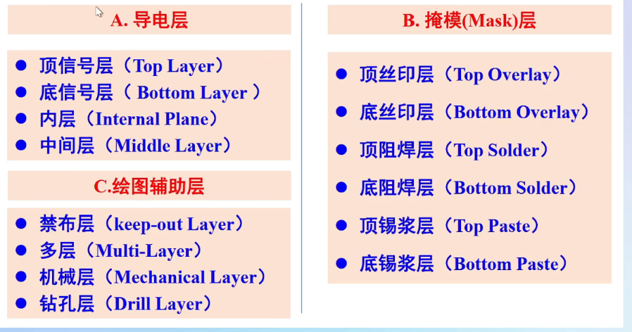

# 前言
笔者在RM时期，就深感硬件知识薄弱，以至于处处受其掣肘，一直想找个时间补习。现在对嵌入式的研究愈发深入后，对硬件知识不足便更加苦恼。为此，我翻出了很久之前收藏的【【教程】零基础入门PCB设计-国一学长带你学嘉立创EDA专业版 全程保姆级教学 】 https://www.bilibili.com/video/BV1At421h7Ui/?p=7&share_source=copy_web&vd_source=8b034ca64cb8bbbd15b0969aebfe1501
等硬件知识教程，并且做做记录，以期有所收获。
最后，由于我是CS专业的，对于电路知识几乎是一无所知的程度，因此这篇文章仅是个人学习的简单记录，若有谬误，欢迎斧正。

# 元件
## 电阻
贴片电阻：
## 电容

# 电路专有名词
## 独立回路

什么是独立回路呢？和独立方程组一样，就是能够引进新的参数的，不能被其他方程（回路）推出的东西。电路分析里的“独立回路”本质上就是图论概念,
- 从图论角度理解
把电路抽象成一张图：  

节点 = 电路中的连接点（三条及以上导线交汇的点）  
支路 = 一个二端元件（或串联的元件组）连在两个节点之间，对应图中的一条边  
回路 = 图中的一个简单环（回到起点且不重复经过节点/边）  
独立回路的定义：一个回路中至少包含一条其他已选回路都没用过的支路。按这个规则一直选下去，直到选不出为止，选出的回路互相独立——每个都带来一条新的约束信息,也就是新的参数。
这里有一个公式：有 b 条支路、n 个节点的连通电路，独立回路数 = b − n + 1，本质上也是基于图论的  
## 网孔
不可再分电路。**平面电路**中被支路围出来的最小“格子”，中间不套任何其他支路。
## 基尔霍夫定律
基尔霍夫定律是一个描述电压/电流关系的定律
### 集总参数电路
在这里的电路分析，都是默认电路是集总参数电路的。由于实际的电子元件，并不是只有电能，实际上有其他的能量转化，例如热能，电势能等等，会产生电磁波等等。
因此，电阻就不是单纯的电阻，在不同频率下，电阻可能是电感/电容/电阻的组合。集总参数电路，即一种简化的，不考虑电磁波等的简化模型。

具体假设是：
电阻就是一个纯粹的电阻，能量耗散只发生在电阻“内部”那一点
电感、电容同理，电磁能的存储/转换只发生在元件本体
导线是理想导线：没有电阻、没有电感、没有电容，而且电流从导线一端流到另一端不需要时间——同一时刻，导线上任意一点的电流都相等。
这个假设，是以下定律的前提。
####  为什么高频电路要求特殊
前面说到，在不同频率下，电阻可能是电感/电容/电阻的组合。而c=uλ，因此对于一个元器件，其电信号频率越高，波长越短。波长越短，其越与尺寸相关，为了简化，我们通常默认电子元器件的尺寸远小于其波长。
### KCL
也就是基尔霍夫电流定律  
流入任一节点的电流之和 = 流出该节点的电流之和。

本质是电荷守恒：节点只是一根导线上的一个点，不储存电荷，所以每秒流进多少库仑就必须流出多少，否则电荷会凭空堆积。

### KVL
KVL：基尔霍夫电压定律
沿任一闭合回路绕行一圈，所有电压降的代数和 = 0。

本质是能量守恒：电压是单位电荷的能量差。电荷沿回路走一圈回到出发点，它的电势必须回到原值——中间在电阻上“掉”下去的所有电势，必须被电源“抬”上来的电势补齐。你绕圈回到起点，海拔净变化为零。

# 原理图

NC:Not Connected不连接
出现在芯片引脚定义表里。表示这个引脚内部没有连接任何东西，你设计电路时悬空不接即可（有些芯片注明"NC, do not connect"，那种内部其实连了东西但不许你用，照悬空处理）。
NF:Not Fixed不安装
出现在原理图和 BOM 表里。意思是这个元件位置画了、预留了，但默认不焊接，留给你按需选用（比如预留的调试电阻、可选的滤波电容）。同义的还有 DNP（Do Not Populate）、DNI（Do Not Install）、N.M.。日系厂商（罗姆、村田、TDK 等）的数据手册特别爱用 NF。
0R: 0 Ω ,可以被短路
字面意思：一个标称阻值为 0Ω 的电阻（实际约几毫欧到 50 毫欧），封装和普通贴片电阻一模一样（0402、0603、0805 等），丝印上印 "0" 或 "000"。它不提供任何阻值，存在的意义是当一根“可控的导线”用。
## LDO/DCDC
## 电平转换

# PCB
## PCB结构
PCB通常由三种原材料组成：
1. 芯板（Core，棕色那张）

一块硬质的“玻璃纤维 + 环氧树脂”板，也就是 FR4——你见过的所有绿色板子的“骨头”。它的关键特性：出厂时两面已经各覆了一层铜箔。所以芯板 = 绝缘骨架 + 两面铜。

2. 半固化片（PP，黄色那张）

也是玻璃纤维浸环氧树脂，但树脂只半固化，还是“半熟的胶”。它在高温高压下会软化流动，冷却后彻底变硬——它就是三明治里的“胶水层”，负责把多层板粘成一体。

3. 铜箔（纯铜的薄 sheet）

单独的铜皮，用来做最外层的走线

所谓的多层PCB，就是以上三者的堆叠。最表面有一层阻焊层，盖住铜箔。
这里有一些细节需要注意：
铜厚：1oz/2oz，铜箔厚度，决定走线载流能力，具体好像有个计算网站。
板厚：1.6MM是默认的。看工况改
铝基板/MCPCB：FR4换成铝合金，为了散热用的，通常来说LED会用，这个嘉立创不免费。
FPC:柔性板，聚酰亚胺基材能弯折，基本上是屏幕排线什么的
高频板：特殊介质，射频什么的才会用
## 阻焊层/开窗

## 铺铜
## 过孔
通孔，埋孔，盲孔，一图就看懂了：

## 焊盘
## 丝印
# EDA
值得一提的是,工业设计上EDA不仅包括AD等，还有一系列自动化分析/处理软件，是个规模非常大的集群。这里全部以嘉立创EDA为例子：
## PCB设计流程
一个完整的工程从建工程开始，分成原理图和 PCB 两条并行的线，最后各自导出产物：

需要注意的几个点：

- 左侧的“新建器件”是可选的。库里已经有现成的符号和封装就直接跳过；没有才自己画，画完依次绑定符号、绑定封装、添加元件属性。
- “转为PCB”是两条线的交汇口：原理图侧的连线关系在这里被同步到 PCB 侧，然后接上 PCB 的“布局”。
- DRC（Design Rule Check，设计规则检查）：一种用于确保电子设计满足特定制造工艺要求的质量保证措施。原理图侧和 PCB 侧各查一次，前者看连接关系，后者看线宽、间距、孔径这些能不能做出来。
- 产物分两份：原理图侧导出 BOM（物料清单，用于采购和贴片），PCB 侧导出 Gerber（光绘文件，交给板厂生产用）。

## EDA分层

### 信号层
信号层，在双层板中需要注意的只有顶层和底层。顶层是红色，底层是蓝色。
### 阻焊层
紫色，画上去的表示扣掉（不覆盖阻焊剂，也就是开窗）
### 丝印层
顾名思义
### 锡膏层
用于生成钢网的层，和元件的区别基本上就是有没有通孔
### 多层
对于多层板，过孔由于穿过所有层，一般会以灰色来表示，称之为多层，也可以手动指定来避免铺铜覆盖
### 机械层/板框层
用于指出PCB的外观/尺寸
### 禁止区/文档层
禁止区：用于和其他人合作的时候避免有人丢奇怪的线路进去的地方，我们基本上用不到
文档层：顾名思义。用不到

## 元件符号与封装
小圆点通常来说是拿来对齐的
## EDA快捷键（这里用AI整理了）
以下整理自官方用户指南的《[快捷键](https://prodocs.lceda.cn/cn/introduction/hotkeys/)》和《[个人设置](https://prodocs.lceda.cn/cn/introduction/settings/)》两页，默认风格为“嘉立创EDA专业版”。

有个前提要先知道：专业版从 v1.8 开始用**单键呼出顶部菜单**，所以原来靠单键触发的功能基本都改成了 `Alt+` 组合。如果你看的是老教程（W 画线、P 放焊盘、V 放过孔那种），那是标准版的路子，在专业版里得多按一个 Alt。快捷键入口在顶部菜单 → 设置 → 快捷键，支持切换“专业版 / 标准版 / Altium Designer”三种风格，也能逐个自定义；冲突时会标出来，不解决不让保存。菜单项上按住 `Ctrl+左键` 也能直接打开快捷键编辑弹窗。

### 通用
| 功能 | 快捷键 |
| --- | --- |
| 取消绘制状态（默认）/关闭弹窗 | `鼠标右键单击`、`Esc` |
| 打开工程 | `Ctrl+O` |
| 新建工程 | `Shift+N` |
| 保存 | `Ctrl+Shift+S` |
| 保存全部 | `Ctrl+S` |
| 撤销 / 重做 | `Ctrl+Z` / `Ctrl+Y` |
| 剪切 / 复制 / 粘贴 | `Ctrl+X` / `Ctrl+C` / `Ctrl+V` |
| 交叉选择（原理图与 PCB 联动） | `Shift+X` |
| 布局传递 | `Ctrl+Shift+X` |
| 根据中心移动 | `M` |
| 删除所选 | `Delete` |
| 上一页 / 下一页（新建图页） | `Page Up` / `Page Down` |
| 全屏 | `F11` |
| 全选 | `Ctrl+A` |
| 查找替换 | `Ctrl+F` |
| 查找相似对象 | `Ctrl+Shift+F` |
| 适应全部 | `K` |
| 视图向左/右/上/下滚动 | `Left` / `Right` / `Up` / `Down` |
| 高亮网络 / 取消高亮 | `Shift+H` |
| 切换单位 | `Q` |
| 展开/收起底部面板 | `\` |
| 左向旋转 | `Space` |
| 对齐：左 / 右 / 顶 / 底 | `Ctrl+Shift+L` / `R` / `O` / `B` |
| 居中：左右 / 上下 | `Shift+Alt+E` / `Shift+Alt+H` |
| 对齐网格 | `Ctrl+Shift+G` |
| 等距分布：水平 / 垂直 | `Ctrl+Shift+H` / `Ctrl+Shift+E` |
| 微调所选图形：左/右/上/下 | `Left` / `Right` / `Up` / `Down` |
| 放置元素时显示属性对话框 | `Tab` |
| 选中对象时切换选中范围 | `Tab` |
| 长按 Shift：矩形保持正方形、导线锁定横竖 | `Shift`（长按） |
| 移动画布（默认） | `鼠标右键`（长按） |
| 重复到光标 / 重复到其他层 | `Ctrl+D` / `Ctrl+Shift+D` |
| 组合选中 / 取消组合 | `Ctrl+G` / `Shift+G` |
| 新窗口打开文档 | `Ctrl+Shift+左键` |
| 关闭当前标签 / 关闭所有标签 | `Shift+&#96;` / `Ctrl+Shift+&#96;` |
| 打开帮助文档 | `F1` |

### 原理图/符号
| 功能 | 快捷键 |
| --- | --- |
| 绘制导线 | `Alt+W` |
| 绘制总线 | `Alt+B` |
| 绘制引脚 | `Alt+P` |
| 绘制矩形 / 圆形 / 折线 | `Alt+R` / `Alt+C` / `Alt+L` |
| 绘制文本 | `Alt+T` |
| 放置网络标签 | `Alt+N` |
| 高亮 / 取消高亮网络导线 | `Shift+H` |
| 放置器件 | `Shift+F` |
| 放置引脚/网络标签/网络端口时弹出属性对话框 | `Tab` |

### PCB/封装
| 功能 | 快捷键 |
| --- | --- |
| 单路布线 | `Alt+W` |
| 布线时切换常用线宽 | `Shift+W` |
| 布线/放置过孔时切换常用过孔 | `Shift+V` |
| 差分对布线 | `Alt+D` |
| 等长调节 | `Shift+A` |
| 等长调节时增大/减小间隙 | `Num+` / `Num-` |
| 高亮 / 取消高亮网络导线 | `Alt+H` |
| 显示/隐藏所选飞线 | `Ctrl+R` |
| 取消全部高亮 | `Shift+H` |
| 切换图层亮度 | `Shift+S` |
| 翻转板子 | `Alt+F` |
| 放置过孔 | `Alt+V` |
| 放置单个焊盘 | `Alt+P` |
| 左右翻转 / 上下翻转 | `X` / `Y` |
| 布线拐角 | `L` |
| 距离测量 | `Alt+M` |
| 切换单位 | `Q` |
| 切换到顶层 / 底层 | `Alt+T` / `Alt+B` |
| 切换到内层 1~4 | `1` `2` `3` `4` |
| 切换到上一个/下一个铜层 | `Shift+Num*` / `Num*` |
| 隐藏/显示铺铜区域 | `Shift+M` |
| 重建所有铺铜 | `Shift+B` |
| 完成 / 取消 / 回退 | `Enter` / `Esc` / `Backspace` |
| 选择重叠图元 | `G` |
| 绘制时翻转路径 | `Space` |
| 显示所有图层 | `Shift+L` |
| 临时显示/隐藏网络名 | `Ctrl+Q` |
| 吸附 | `Alt+S` |

### 不在表里但很值得记的几个
- `Shift+W` / `Shift+V` 切换的候选值来自个人设置里预先填好的“常用线宽”和“常用过孔尺寸”，不先去设置里加几条，按了也没得选。
- 个人设置里还能调画布缩放方式（滚轮缩放 or `Ctrl+滚轮`，会影响触摸板的行为）、中键是拖画布还是缩放、面板自动收起、网格尺寸等。
- 在画布上按住 `Ctrl+左键` 拖动元素，等于“复制到光标处”，松开即粘贴；再按一下 `Esc` 或右键退出。对名称以数字结尾的导线、网络标签、文本，会自动把编号 +1。
- 选中图元后按 `Enter` 直接展开右侧属性面板并聚焦到关键属性上，比右键找属性快。

## 经典电路