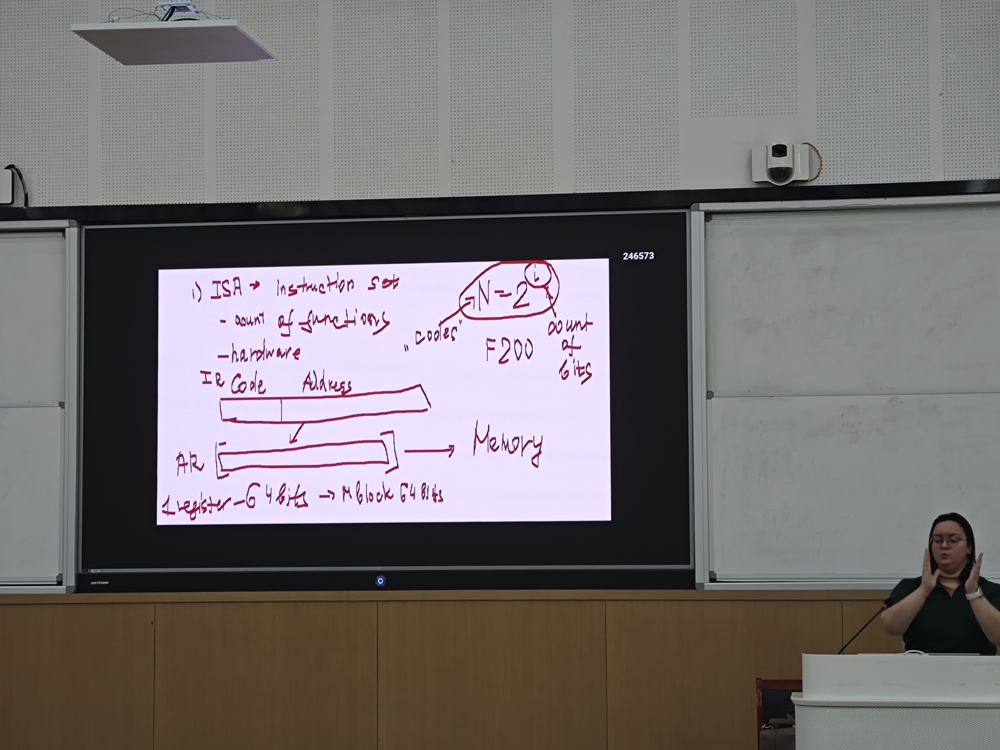

# 前言
这门课主要是理论课，不存在lab，但是知识点繁多，因此我记录笔记如下。
# 第一节课：basic concept and computer architecture.
有四次期中考，平时成绩和期末占比6:4
- ISA:Instruction set architecture.指令集，分为精简指令集(RISC)和复杂指令集（CISC）
- Micro-architecture:
DataPath:数据通路
Controller:控制器
## 计算机系统的概念：
包含了从汇编到处理器，IO,内存，数据通路/控制器这一块。更底层的digital design和circuit design，transistors 不涉及这段内容。
（接下来是些为什么要学这门课的碎碎念我就跳过了）

数据处理
数据储存
数据移动
计算机控制：以上所有行为的控制
（然后又是一大段历史，懒得记了）
embedded system


input unit MICR...
output unit..
ALU(Arithmetic logic unit):在处理器内部的逻辑处理器单元，用于加法触发等


第二节课开始有测试。
binary，line by line，address，第四点elona记不得了（笑），大概是common memory:
```
binary（二进制）：计算机里的一切信息——数据也好、程序也好——全都是用二进制表示的。内存里没有“这是数据、那是代码”的天然区分，全都是一串串的 0 和 1。

line by line（逐行存放）：程序是指令的序列，写好后被翻译成二进制，一条接一条地存进内存里，就像存数据一样。执行时 CPU 一条一条往外取。

address（地址）：内存的每一个格子都有编号，也就是地址。CPU 里有个程序计数器（PC），记着“下一条要执行的指令在哪个地址”，取完一条就加一，所以程序能顺序执行下去。
```
普林斯顿架构中，数据和程序共享内存。(普林斯顿架构就是冯·诺依曼架构的另一个名字（普林斯顿大学是最早实现它的地方）。它的定义就是：程序和数据放在同一块内存里，走同一条总线。对比的是哈佛架构（Harvard architecture）——程序存一块独立的内存，数据存另一块，比如很多单片机、DSP 就是这么做的。)

ALU
Interface(接口)的概念
Bottle neck（瓶颈），指出总线/处理器等的宽带/计算频率中最弱的部分会限制整体的发挥
virtual port，virtual memory



这里elona画了一张图来表示指令是怎么写的
1. "IR" 和 "AR"

IR（Instruction Register，指令寄存器）：CPU 从内存取出一条指令后，先放进 IR，硬件再把它的 Code 段和 Address 段拆开。
AR（Address Register，地址寄存器）：拆出来的地址段被送进 AR，AR 指向内存，按这个地址去取数据——所以图里箭头从 AR 画到 Memory。


2. " ISA → instruction set — count of functions — hardware" ISA 的定义：它规定了处理器支持哪些指令（多少种功能），以及由硬件来实现。这是 ISA 和纯硬件设计的分界线。

3.指令格式。
"N = 2^k" 和 "count of bits" 
"0000"、"F200" 这是举例：把一条 16 位的指令写成十六进制就是 F200，展开成二进制是：


4. "Register 64 bits → M block 64 bits" 
这是说寄存器和内存数据块宽度一致：寄存器是 64 位，内存一个块（block）也是 64 位，所以一次访存正好搬一个寄存器宽度的数据，不需要拼拆。

所以指令就是指令段+地址段，地址段会被拆分送入AR，然后对其执行指令段的命令。


在进入下半部分之前有个小例子。主要是关于一个灯光控制系统的，也就是红绿灯。要求是能通过按钮变成绿灯，可以红绿灯切换，然后还有倒计时闪烁。然后分析了一下需要的元件（cpu。memory什么的）以及控制流。
然后不知道为什么他又觉得要加入input buffer register(IBR)，circuit，amplifier（放大器）
然后引入了中断（~~虽然我觉得没必要吧，事件驱动+前后台就行了~~）然后有中断就得有栈stack，然后就得有ROM（只读储存器，这里用了其断电不掉数据的特性）RAM(随机访问内存，就是通常意义上的内存)

最后统计了可能用到的寄存器，总线，等等
- Instruction cycle:
Instruction cycle（指令周期）就是 CPU 不断重复的一个固定流程：取出一条指令 → 执行它 → 再取下一条。
具体来说就是以下这张图：


指令有多种表达方式，2进制，16进制，以及助记符(Mnemonic)。
op:operational code操作数

所以，实际上这一段是在建立一个整体的运行概念，指令是从哪里来的，如何执行的，长什么样

在建立这个概念之后，我们就需要逐步分析各个环节的具体过程。

CPU:
输入flag，clock
解码器:
和图灵完备里的一样，这里是个3位解码器

