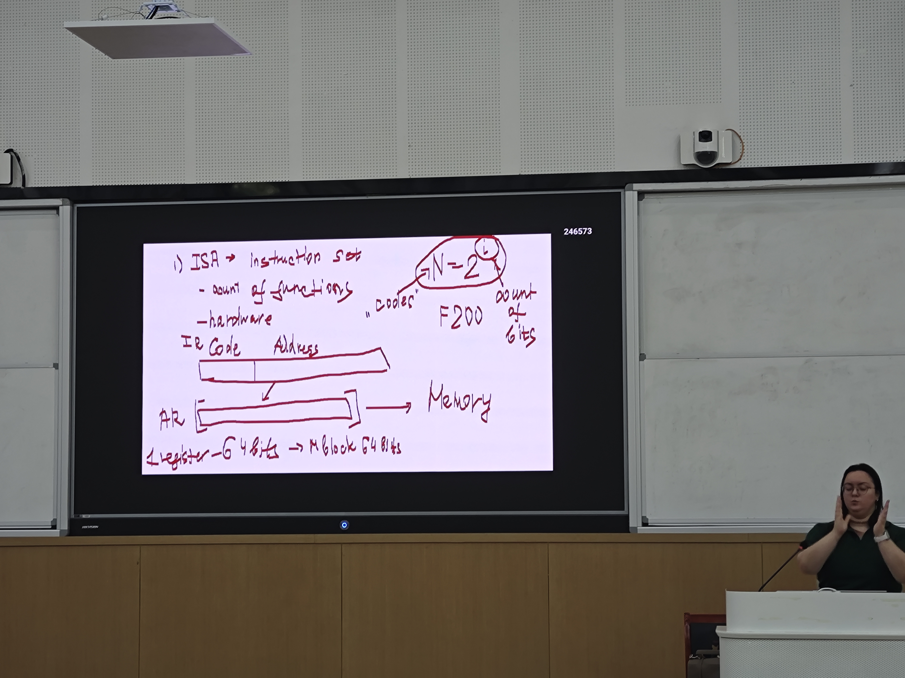
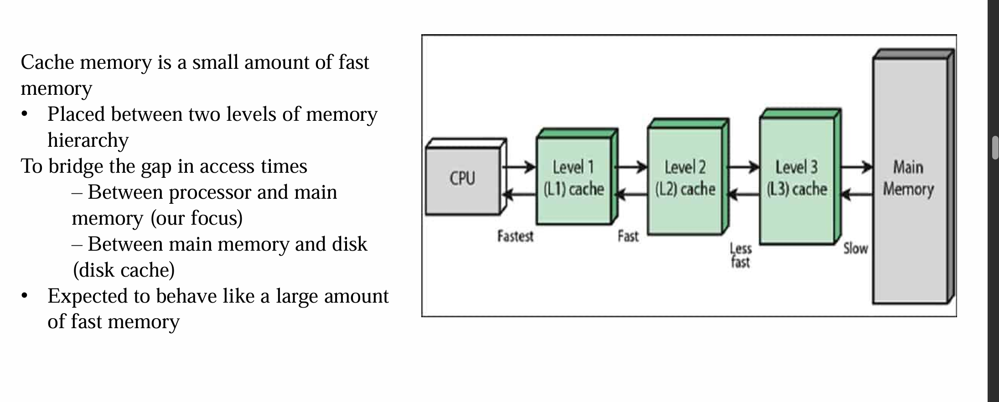

# 前言
叠甲：部分使用了AI解释，不保证一定正确
这门课主要是理论课，不存在lab，但是知识点繁多，因此我记录笔记如下。
# 第一节课：basic concept and computer architecture.
有四次期中考，平时成绩和期末占比6:4
- ISA:Instruction set architecture.指令集，分为精简指令集(RISC)和复杂指令集（CISC）
- Micro-architecture:
DataPath:数据通路
Controller:控制器
## 计算机系统的概念：
包含了从汇编到处理器，IO,内存，数据通路/控制器这一块。更底层的digital design和circuit design，transistors 不涉及这段内容。
（接下来是些为什么要学这门课的碎碎念我就跳过了）

数据处理
数据储存
数据移动
计算机控制：以上所有行为的控制
（然后又是一大段历史，懒得记了）
embedded system


input unit MICR...
output unit..
ALU(Arithmetic logic unit):在处理器内部的逻辑处理器单元，用于加法触发等


第二节课开始有测试。
binary，line by line，address，第四点elona记不得了（笑），大概是common memory:
```
binary（二进制）：计算机里的一切信息——数据也好、程序也好——全都是用二进制表示的。内存里没有“这是数据、那是代码”的天然区分，全都是一串串的 0 和 1。

line by line（逐行存放）：程序是指令的序列，写好后被翻译成二进制，一条接一条地存进内存里，就像存数据一样。执行时 CPU 一条一条往外取。

address（地址）：内存的每一个格子都有编号，也就是地址。CPU 里有个程序计数器（PC），记着“下一条要执行的指令在哪个地址”，取完一条就加一，所以程序能顺序执行下去。
```
普林斯顿架构中，数据和程序共享内存。(普林斯顿架构就是冯·诺依曼架构的另一个名字（普林斯顿大学是最早实现它的地方）。它的定义就是：程序和数据放在同一块内存里，走同一条总线。对比的是哈佛架构（Harvard architecture）——程序存一块独立的内存，数据存另一块，比如很多单片机、DSP 就是这么做的。)

ALU
Interface(接口)的概念
Bottle neck（瓶颈），指出总线/处理器等的宽带/计算频率中最弱的部分会限制整体的发挥
virtual port，virtual memory



这里elona画了一张图来表示指令是怎么写的
1. "IR" 和 "AR"

IR（Instruction Register，指令寄存器）：CPU 从内存取出一条指令后，先放进 IR，硬件再把它的 Code 段和 Address 段拆开。
AR（Address Register，地址寄存器）：拆出来的地址段被送进 AR，AR 指向内存，按这个地址去取数据——所以图里箭头从 AR 画到 Memory。


2. " ISA → instruction set — count of functions — hardware" ISA 的定义：它规定了处理器支持哪些指令（多少种功能），以及由硬件来实现。这是 ISA 和纯硬件设计的分界线。

3.指令格式。
"N = 2^k" 和 "count of bits" 
"0000"、"F200" 这是举例：把一条 16 位的指令写成十六进制就是 F200，展开成二进制是：


4. "Register 64 bits → M block 64 bits" 
这是说寄存器和内存数据块宽度一致：寄存器是 64 位，内存一个块（block）也是 64 位，所以一次访存正好搬一个寄存器宽度的数据，不需要拼拆。

所以指令就是指令段+地址段，地址段会被拆分送入AR，然后对其执行指令段的命令。


在进入下半部分之前有个小例子。主要是关于一个灯光控制系统的，也就是红绿灯。要求是能通过按钮变成绿灯，可以红绿灯切换，然后还有倒计时闪烁。然后分析了一下需要的元件（cpu。memory什么的）以及控制流。
然后不知道为什么他又觉得要加入input buffer register(IBR)，circuit，amplifier（放大器）
然后引入了中断（~~虽然我觉得没必要吧，事件驱动+前后台就行了~~）然后有中断就得有栈stack，然后就得有ROM（只读储存器，这里用了其断电不掉数据的特性）RAM(随机访问内存，就是通常意义上的内存)

最后统计了可能用到的寄存器，总线，等等
- Instruction cycle:
Instruction cycle（指令周期）就是 CPU 不断重复的一个固定流程：取出一条指令 → 执行它 → 再取下一条。
具体来说就是以下这张图：


指令有多种表达方式，2进制，16进制，以及助记符(Mnemonic)。
op:operational code操作数

所以，实际上这一段是在建立一个整体的运行概念，指令是从哪里来的，如何执行的，长什么样

在建立这个概念之后，我们就需要逐步分析各个环节的具体过程。

CPU:
输入flag，clock
解码器:
和图灵完备里的一样，这里是个3位解码器


IO:

Memory:

总线（BUS):
control line
address line
data line


点对点传输：
不经过总线的传输，比如多核CPU的核间交流，


这里要注意这是表示数字的转换，不是大小的转换，也就是没有整数进位之类的东西

cache memory 

内存分为primary memory和secondary memory。（主内存和次级内存）
其实就是中文里面内存(通常来说的RAM)和储存(通常来说的ROM或者其他的磁盘)的概念而已（
register memory，cache memory
on-line mass memory
offline bulk memory

后面非常无聊地讲了储存和内存的区别.....
神他妈shark Mashine
Счётная машина(俄语“计算机”)——如果你看的是苏联时代的纪录片或翻译教材，электронно-счётная машина(电子计算机)音译过来很容易被写成"shark machine";

内存是分成虚拟的和真实的，通过内存表来映射到物理内存（为了寻址方便）。
后面讲了缓存到内存的映射,AI是这么解释的：


### 右边 Memory：
主存，按字（word）编址，每个字 32 位 = 4 字节。字地址 0、1、2…… 每 8 个字（8 × 4B = 32 字节）划成一个块（block）：字 0–7 是 block 0，字 8–15 是 block 1，字 16–23 是 block 2。彩色格子表示正在运行的程序访问到的那些字。
### 左边 Cache：
直接映射缓存，共 8 行（line 0–7）。每行有三个字段：Valid Flag（有效位，标记这一行是否有有效数据）、Block Number（标签，记录当前缓存的数据来自哪个内存块，用来区分“同位置但不同块”的情况）、Value（真正缓存的那 4 字节数据）。
红色箭头：展示了映射关系——内存字 3、字 11、字 19 都指向缓存的第 3 行。
核心规则：直接映射

每个内存块只能放进缓存的固定一行，位置由取模决定：

cache line = (block 地址) mod (缓存行数)
缓存有 8 行，所以字 3、11、19 满足 3 mod 8 = 11 mod 8 = 19 mod 8 = 3，全都被映射到第 3 行。这就是图中三支箭头汇聚到同一行的原因。

这个设计的代价

因为多个内存块共享同一缓存行，就必须靠 Block Number（tag） 来区分“现在这行里存的到底是 block 0、block 1 还是 block 2 的字 3”。CPU 访问时把地址拆成三段：低位是行内偏移（4B 一个字 → 2 位），中间是行号（8 行 → 3 位），剩下的高位是 tag，与缓存行里存的 tag 比较；命中且有效位为 1 才能直接用，否则就要把整块数据从内存换进来，把原来占位置的块挤出去——这就是直接映射缓存最容易发生**冲突失效（conflict miss）**的原因：哪怕缓存没满，两个轮流访问的地址只要 mod 8 同余，就会不停地互相顶替。


**简而言之的话**，就是缓存是分行的，每行对应一个固定大小的内存块。CPU为了快速起见每次读取内存都是一块一块取的，这个映射就是为了让你明白CPU索要的内存数据块是否是存在缓存里的那块。为了保证这个是正确的，缓存会以行为单位映射多个块的内存。例如行3对应第三个、第十一个、第十九个块。  
当CPU想访问一个地址的时候，首先会去缓存进行查询。原始的内存地址是连续的一系列数字，缓存会对其做处理，例如缓存字地址19：
tag = 10（block 2）  index = 011（第 3 行）  offset = 11

字 19 在真实内存里占的是字节地址 76–79（19 × 4），它只是个普通的数。  

“块结构”是缓存硬件强加给地址的，不是地址自带的  

缓存设计者先定下两个参数：一行装多大（比如 64 字节）、一共多少行（比如 512 行）。然后才把任何拿来的地址机械地切三段：
```
低 log2(64)=6 位 → 行内偏移
中间 log2(512)=9 位 → 行号
剩下的高位 → tag
```

切法完全由缓存的几何参数决定。同一台机器上，L1 和 L2 的行数、行大小不同，同一份地址会被切成完全不同的三段；如果是全相联缓存（无行号），干脆没有 index 段。所以不是地址“天生”带了块信息，而是缓存拿着尺子去切地址——尺子刻度变了，切出来的块就变了  

现在我们CPU依然要找19这个地址的数据，然后19的地址给到了缓存：  
缓存将其理解为这块内存要到缓存的line3，然后会开始匹配Tag，如果匹配成功，那么就会把这里的valid flag置为1，接着CPU会开始读。  
如果tag不正确，这块内存作废，重新从内存里面读（比如可能这行存的是3或者11的数据块）  
**自始至终，CPU永远使用原始内存地址，只不过缓存巧妙地实现了以块形式的映射和寻址**（当然现代计算机里面多个MMU，会多映射一层，就是前面提到的物理内存变成虚拟内存）
(教材17页有细讲这个)  
### 三级缓存：
为了解决CPU转的太快RAM太慢，我们需要缓存。但是缓存通常来说不够大，所以引入了多级缓存。

在这张图里，每个缓存都把下一级当成内存看待，因此形成了逐层寻找的机制，最大程度避免了miss的影响。


### 缓存命中率
1. 命中率 h（hit ratio）

定义就是一行字：命中的访问次数 ÷ 总访问次数。把程序跑起来统计所有内存访问，命中占的比例就是 h。课件给的典型值是 0.90–0.97，意思是绝大多数访问都被缓存拦下了，根本轮不到内存出场。

2. 缺失率 m = 1 − h

就是命中率的反面，两者互补：命中 95%，缺失就是 5%。有的资料爱用这个口径，本质同一个数。

3. 平均访存时间（核心公式）

T = h × T缓存 + (1−h) × T内存
这里的T是时间，也就是平均访问内存的时间是命中率与内存/缓存读取时间的加权和。
最后，“如果有多级缓存，公式要按显然的方式修改”，指的就是上面那种方式：每一级都有自己的平均访存时间，把他们看成一系列的缓存/内存集合体，我们就可以得到：
```
T = h₁×T₁ + (1−h₁)×h₂×T₂ + (1−h₁)(1−h₂)×h₃×T₃ + …
```
