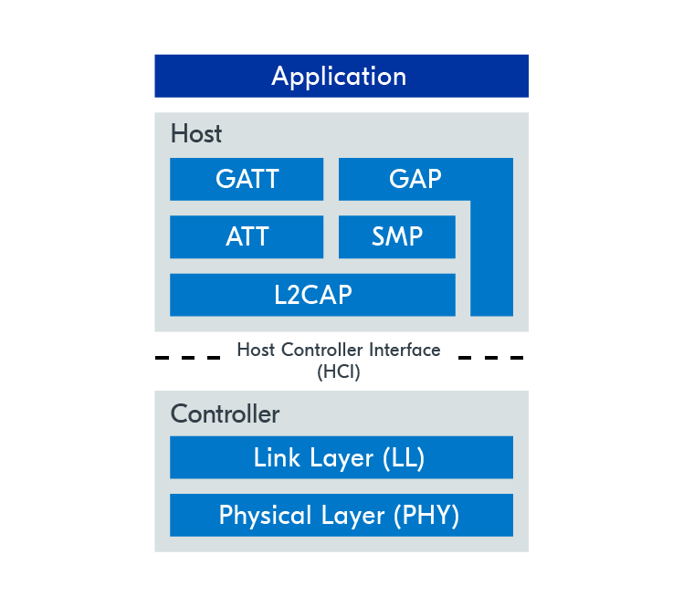

# 前言
这个项目旨在复刻合金装备幻痛5中出现的精工G757手表。由于抽到了nordic的DK，所以主要以nRf54l15为主。这里的蓝牙特指的是低功耗蓝牙（LE）而不是classic蓝牙。
# 蓝牙组成
这里大部分的内容都来自于Nordic的蓝牙教程，因此非常推荐去亲自看看。  

从图中可以看到，蓝牙被分成了两大块，HOST和Controller。上层是软件协议层，下层是硬件抽象link layer和硬件层。
 
- 逻辑链路控制与适配协议（L2CAP）：为上层提供数据封装服务。

- 安全管理协议（SMP）：定义并提供安全通信的方法。

- 属性协议（ATT）：允许设备将某些数据片段暴露给另一设备。

- 通用属性配置文件（GATT）：定义使用 ATT 层所需的子程序。

- 通用访问配置文件（GAP）：直接与应用程序接口，处理设备发现和连接相关服务。

controller层有多种实现，官方推荐使用softdevice控制器，你也可以更换成其他开源，包括zephyr的LE蓝牙控制器。
# 蓝牙的模式
蓝牙有两种模式：连接模式和广播模式。
广播是单向的，同时因为不需要建立点对点的连接，其完全可以在广播范围内向无数个设备同时发送信息。通常来说，这也更省电。
连接是双向的，
广播模式下又分为：

## Central and peripheral  中央与外围
(~~什么外围？~~)  
蓝牙可以被设置为中央设备和外围设备。
中央设备负责轮询扫描，外围设备又被称为外设，负责数据输送给中央设备。  
连接模式下，中央和外围可以相互通信，而广播中外围只能向中央广播，无法接收任何回馈  
值得注意的是，广播模式下，中央依然是负责接收的那一方，发送的是外设方。  

- GAP 的中央/外设到底规定了什么:
GAP的规则大概可以分为两个问题的组合：“发不发广播” × “参不参与连接”：

只发广播、不理连接 → Broadcaster（信标）
只收广播、不建连接 → Observer（静默观察）
发可连接广播、等人来连 → Peripheral（外设）
收广播、主动发连接请求 → Central（中央设备）  

广播模式出现在发现期：外设按自己的节奏在 3 个广播信道上循环发包，中央盲扫。中央一旦决定连接，就在监听到广播包后的 150 μs 固定间隔处回一包 CONNECT_IND，从此双方脱离广播信道、进入数据信道，进入同步的连接态——ATT/GATT 就是在这个阶段开始干活的。  

关于拓扑，这里不赘述了，建议参考https://academy.nordicsemi.com/courses/bluetooth-low-energy-fundamentals/lessons/lesson-1-bluetooth-low-energy-introduction/topic/gap-device-roles-and-topologies/#connected-topology
随着蓝牙 5.4 中周期性广告响应（PAwR）的引入，实现了无连接模式下的双向通信，不过Nordic并没有深入探讨。  

以上的部分都可以归为GAP层，即描述设备角色和网络拓扑情况的层。

广告期间的通信仅用于设备发现或数据广播，由 GAP 层本身处理。然而，建立连接后，需要双向数据交换。这需要专门为这些目的定制的数据结构和协议。
# ATT层与GATT层
GAP层只负责设备间的互相发现和广播。真正连接后，ATT层会转而负责数据传输、接收和处理。这里也有一个服务端-客户端的概念，不过和前面的主机/外设是独立的，主机可以是客户端也可以是服务端，取决于实际的需求。
ATT定义属性（attribute）这个数据结构。服务器的全部数据就是一张扁平数组，每行四个字段：
Handle：16 位编号，相当于内存地址
Type：一个 UUID，标记“这是什么类型的条目”
Value：任意字节
Permissions：可读？可写？要不要加密？
同时，其还定义一组操作动词。读请求/读响应、写请求/写响应、通知、指示、交换 MTU……全都是“对某个 handle 做某事”。
在ATT阶段，会规定服务端/客户端，因为ATT只是规定了一种数据结构，因此上层的GATT可以拥有多重属性，也就是可以同时是客户端或者服务端。  

    通用属性配置文件（GATT）层直接位于 ATT 层之上，通过将属性层级分类为配置文件、服务和特性来构建。GATT 层利用这些概念来规范蓝牙 LE 设备之间的数据传输。  
    nordic举了个例子：用一个测量心率的传感器设备为例。心率值将被保存为一个属性，称为特征值属性 。还有另一个属性，存储价值属性中存储的数据元数据，称为特征声明属性 。这两个属性共同构成了所谓的特征 。在这个例子中，它是心率测量特征。
    所有特征都包含在所谓的服务中。服务通常包含多个特性。在本例中，心率测量特征包含在心率服务中。该服务还有其他特性，比如人体传感器位置特性。
    再往上，配置文件是一个或多个服务，针对相同的使用场景。心率服务可在心率配置文件中找到，同时还有设备信息服务。设备信息服务包含诸如制造商名称特征和固件修订特性等特征。  
GATT的特征规定大概是：https://www.bluetooth.com/specifications/specs/
在客户端开始与服务器交互之前，客户端并不知道该服务器上存储属性的性质。因此，客户端首先执行所谓的服务发现 ，即向服务器询问属性。  

至于PHY层，东西很少，具体实现因人而异，但是具体有三种规范：
1M,2M,自定义;
# 蓝牙的连接流程
前面提到，蓝牙可以分为广播和连接模式，实际上不太准确，准确地说，广播应该是连接流程的一部分，只不过你可以停在这个部分不继续深入。蓝牙 LE 中的广告主要用于两个目的。用于向邻近设备广播数据，或向其他设备展示其存在。Nordic的Lesson2讲的就是如何纯粹在广播阶段先搭建好蓝牙。
## Advertise广告/广播阶段
在这个阶段，作为外设的蓝牙设备会开始间隔性地发送广播包。发送广告/广播 包的时间间隔就是广告/广播间隔（之后统一称为广告，不再称之为广播了）  
设备通过40个不同的频率信道进行通信。这些频道分为三个主广告频道和37个次级广告频道。主要广告渠道是指主要用于广告目的的频道。次级广告通道有时也可用于广告目的，但主要用于建立连接后的数据传输。  
为确保一定程度的冗余，广告包会在三个主要广告通道——频道37、38和39上发送。同时，扫描设备会扫描这三个通道，以寻找广告设备。  
由于广告包对于建立连接至关重要，主要广告渠道会被仔细选择。37、38 和 39 频道虽然是连续编号，但实际上并不是相邻频道，如上图所示。三信道之间的分离旨在避免相邻频段的干扰。此外，这三个特定频道在使用 ISM 频段的其他技术（如 Wi-Fi）噪声影响最小。   
与广告间隔类似，扫描间隔指的是扫描仪扫描广告包的频率。扫描窗口指的是扫描器扫描数据包的时间，实际上代表设备在每个扫描间隔内扫描与未扫描的占空比。  
由于广告是在三个频道上进行的，所以扫描也需要如此。每轮扫描间隔后，扫描器都会轮换一个频道。
扫描比广告耗电的多，因此一般是作为中央设备，在供电情况更好的设备上使用。  
显然的，扫描/广告间隔越短，连接越快，耗电越快。所以通常来说，如果你同时控制中央设备和外设，你可以进行适当的间隔调整来达到最省电且连接最快的效果。  
- 扫描请求
在这个阶段中，中央设备可以对扫描到的外设发送扫描请求以期获取更多信息。如果扫描请求被接受，外设会通过三个主要广告通道进行扫描响应。这是一种无需连接就可以交流的方式，如果外设没有更多信息可提供，也可以选择返回空扫描响应。
- 拓展广告包
另一种增加外设一次性可投放数据量的方法是使用一种称为扩展广告的功能。通过该功能，主广告信道上广播的广告包指向了在次级广告信道上宣传的补充信息。扩展广告超出本课程范围，我们将只关注传统广告。  

### 广告类型
广告可以分为以下类型：
可连接与不可连接： 决定中央电源能否连接到外设。

可扫描与不可扫描： 判断外设是否接受扫描仪的扫描请求。

有向与无向： 确定广告包是否针对特定扫描器。